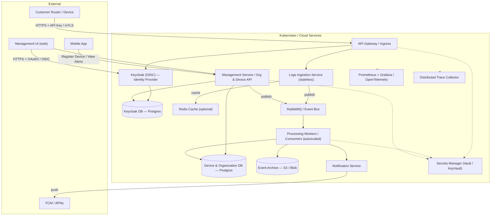

# Use cases

## Purpose

I want to have a cloud system which receives home router logs and sends back security notifications.

Home devices like PCs, mobiles, or TVs should be able to get router logs periodically and send them to the system.

Security event to notify:
* New connected device with unknown IP / MAC 

Notifications should go to the mobile application.

## Backend

Here I'm puting some desired backend use cases. Frontend use cases and UI/UX design will be in a separate document.

* Users can login and manage their organizations.
* Users are able to register devices into their organizations.
* API and users are able to create API tokens

### Architecture

Components & responsibilities

- **API Gateway:** TLS termination, rate limiting, auth, ingress routing, request validation.
- **Keycloak (OIDC):** Use Keycloak as the identity provider for users and machine identities. Keycloak provides OAuth2/OIDC flows, client credentials, roles, user federation, and an admin UI.
- **Logs Ingestion Service:** Stateless HTTP/HTTPS front-end that validates and normalizes router logs and publishes messages to the event bus; keep minimal CPU work.
- **Event Bus (RabbitMQ):** Durable queueing for decoupling ingestion from processing; use persistence and dead-letter queues.
- **Processing Workers:** Consumer pool that enriches, deduplicates, classifies logs, applies detection rules (e.g., unknown device), writes events to archive and device DB, and emits notification events.
- **Device & Organization DB (Postgres):** Canonical store for organizations, devices, owners, provisioning tokens and mappings; strong constraints and indexes for lookups.
- **Event Archive (S3/Blob):** Append-only storage for raw and processed events for replay, compliance, and analytics.
- **Notification Service:** Aggregates and throttles alerts, sends mobile push (FCM/APNs), and persistent notifications.
- **Management Service / UI:** Org and device management, token provisioning/rotation, device revocation, audit views and admin APIs.
- **Cache (Redis):** Short-lifetime caches for lookups, rate-limiting counters, and locks (optional).
- **Observability:** Metrics (Prometheus), logs (structured JSON to centralized store), distributed tracing (OpenTelemetry), health checks and alerting.

**Keycloak (self-hosted) + Postgres**

We will use a self-hosted Keycloak instance backed by Postgres (`KeycloakDB`). Keycloak handles user credentials, token issuance, client credentials for machine identities, roles, and the admin console — eliminating the need to implement a custom auth service.

Integration notes

- **API Gateway delegation:** The `API Gateway` validates tokens issued by Keycloak (JWT verification or token introspection) and forwards authenticated requests to services.
- **Device identities & machine clients:** Prefer Keycloak `client credentials` or service accounts for routers/devices. For human-style API keys you can map keys to Keycloak clients or keep hashed API keys in `Device & Organization DB` and validate them at the gateway.
- **Provisioning & sync:** `Management` provisions users, clients, and roles using Keycloak Admin API. Use user attributes or a small mapping table in `Device & Organization DB` to map Keycloak `user_id`/`client_id` → `org_id`.
- **Revocation & rotation:** Rotate client secrets regularly; revoke via Keycloak admin APIs. If application services need to react, publish revocation events to the `Queue`.

Security & operational best-practices (Keycloak)

- Run Keycloak with TLS behind your ingress; use Postgres with backups and point-in-time recovery.
- Protect admin accounts with MFA and strict network controls; enable strong password policies and account lockout.
- Prefer short-lived access tokens and validate signatures; use refresh tokens where appropriate and store them securely on clients.
- Store Keycloak DB credentials and master keys in `Secrets` manager and restrict admin API access.
- Monitor auth metrics (failed logins, token issuances) and alert on anomalies.

Multi-tenant mapping

Keep canonical organization metadata in `Device & Organization DB`. Use Keycloak user attributes or a sync process to associate Keycloak users/clients with `org_id`. For devices you can represent each device as a Keycloak client or keep a device table in `Device & Organization DB` with hashed provisioning tokens.

Management & device lifecycle dataflow

1. Organization creation: an admin uses the `Management UI` (or Management API) to create an organization; `Management` writes org record to `Device & Organization DB` and issues initial admin credentials.
2. Device registration: an admin or end-user registers a device via `Management` (web or mobile). `Management` creates a device record with owner/org mapping and issues a provisioning token (or API key) stored encrypted in `Secrets` and the DB.
3. Device provisioning: the device (or router acting on behalf of devices) uses the provisioning token / API key to authenticate with the `API Gateway` when sending logs. The `Auth` service validates keys and looks up device→org mapping in `Device & Organization DB`.
4. Ingestion & enrichment: `Ingest` receives validated logs and publishes normalized messages to `RabbitMQ`. `Worker` consumers enrich messages using `Device & Organization DB` (owner, expected MACs/IPs) and apply detection rules.
5. Unknown device detection: if a log indicates a device (MAC/IP) not present in the registry, `Worker` marks an incident, writes event to `EventsStore`, updates `DeviceDB` (optionally create a pending device entry), and publishes a notification event.
6. Notification delivery: `Notifier` aggregates alerts, respects throttling/aggregation rules, and pushes to `PushGateway` (FCM/APNs). The mobile app can also query `Management` for audit and incident details.
7. Revocation & rotation: admins can revoke provisioning tokens or delete devices via `Management`; `Auth` enforces revocation immediately, and `Management` may publish revocation events to `Queue` for downstream processing.

Dataflow summary

Routers push logs → `API Gateway` (auth & validation) → `Ingest` publishes to `RabbitMQ` → `Workers` consume, enrich (via `Device & Organization DB`), apply rules → write to DB/archive and emit notification events → `Notification Service` delivers to mobile push gateway. Organization and device management operations flow through `Management` → `Device & Organization DB`, which is consulted by both `Auth` and `Worker` components.
* Auth & API-Key Service: Issue/manage API keys and tokens, support OAuth2 for users and API keys for routers, enforce scopes and rate-limits.
* Logs Ingestion Service: Stateless HTTP/HTTPS front-end that validates and normalizes router logs and publishes messages to the event bus; keep minimal CPU work.
* Event Bus (RabbitMQ): Durable queueing for decoupling ingestion from processing; use persistence and dead-letter queues.
* Processing Workers: Consumer pool that enriches, deduplicates, classifies logs, applies detection rules (e.g., unknown device), writes events to archive and device DB, and emits notification events.
* Device Registry (Postgres): Canonical store for devices, owners, and organization mappings; strong constraints and indexes for lookups.
* Event Archive (S3/Blob): Append-only storage for raw and processed events for replay, compliance, and analytics.
* Notification Service: Aggregates and throttles alerts, sends mobile push (FCM/APNs), and persistent notifications.
* Management Service / UI: Org and device management, token management, audit views.
* Cache (Redis): Short-lifetime caches for lookups, rate-limiting counters, and locks (optional).
* Observability: Metrics (Prometheus), logs (structured JSON to centralized store), distributed tracing (OpenTelemetry), health checks and alerting.