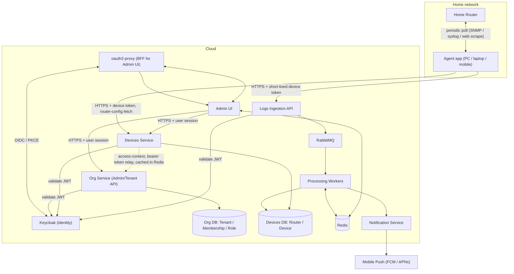

# Overview

## What the system does

HomeSecurity is a multi-tenant SaaS that collects security-relevant logs from
home routers and notifies the owning user (organization) about suspicious
activity — starting with "a new device joined your network that we don't
recognize."

Routers themselves are not expected to talk to the cloud directly. Instead, a
small **agent application** runs on a device already inside the home network
(a PC, a laptop, or a mobile phone) and periodically pulls logs from the
router on the user's behalf, then forwards them to the cloud ingestion API.
See [`05-agents-and-ingestion.md`](05-agents-and-ingestion.md) for details.

## System context

`OrgSvc` and `DevicesSvc` each own their database exclusively — no
cross-service database-level foreign keys — per
[ADR-0016](../decisions/0016-devices-service-owns-its-own-database.md),
which also covers why `DevicesSvc` calls `OrgSvc` (dotted edge above)
instead of querying `OrgDB` directly. The same rule applies to `Workers →
DevicesDB` above: once unknown-device detection is actually built (see
[`06-notifications.md`](06-notifications.md#detection-flow), not yet
implemented), that consumer has to be part of `DevicesSvc` itself — a
separate "Processing Workers" service reaching directly into
`DevicesSvc`'s own database would be the exact anti-pattern ADR-0016
argues against for everything else. This diagram keeps `Workers` as its
own box because the wider event-processing pipeline (enrichment,
future non-device detection rules) may still end up broader than just
device detection — but the device-writing part of it is `DevicesSvc`'s
own consumer, not a separate service's.

## Components

| Component | Role | Built how |
|---|---|---|
| Keycloak | Identity provider for human users (login, MFA, password reset) | Ready container, config-as-code |
| oauth2-proxy | Backend-for-Frontend: does the OIDC login dance so the browser never holds a raw token | Ready container, config only |
| Admin UI | Lets a user manage their organization, devices, and view alerts | Custom (this is the product) |
| Org Service | Manages organizations, memberships, roles/permissions; the source of truth other services call for tenant/permission checks (see [ADR-0016](../decisions/0016-devices-service-owns-its-own-database.md)) | Custom |
| Devices Service | Manages routers (encrypted credentials) and network devices; serves the agent's router-config fetch | Custom (this is the product) |
| Logs Ingestion API | Accepts log batches from agents, validates, publishes to the queue | Custom, thin |
| RabbitMQ | Message bus: decouples ingestion from processing, carries domain events | Ready container |
| Redis | Caches computed permissions (shared across services); gives the Processing Worker idempotency against redelivered messages | Ready container |
| Processing Workers | Enrich, deduplicate, apply detection rules, raise incidents | Custom (this is the product) |
| Notification Service | Turns incidents into push notifications | Custom, thin, delegates to FCM/APNs |
| Org DB | Canonical store for organizations, memberships, roles/permissions | Postgres |
| Devices DB | Canonical store for routers and network devices — a separate database from Org DB, not shared | Postgres |
| Agent app | Runs in the home network, polls the router, forwards logs | Custom, deliberately simple |

The rule of thumb throughout: **if it's about identity, sessions, or the login
handshake, it should be a ready container we configure. If it's about routers,
devices, or detection logic, it's the actual product and we write it.**

## Related documents

- Tenant/data isolation: [`02-multi-tenancy.md`](02-multi-tenancy.md)
- Auth for humans and for agents: [`03-security-and-identity.md`](03-security-and-identity.md)
- Roles/permissions: [`04-roles-and-permissions.md`](04-roles-and-permissions.md)
- Agents and ingestion: [`05-agents-and-ingestion.md`](05-agents-and-ingestion.md)
- Notifications: [`06-notifications.md`](06-notifications.md)
- Caching and idempotency (Redis): [`07-caching-and-idempotency.md`](07-caching-and-idempotency.md)
- API contracts and client codegen (JSON Schema): [`08-api-contracts-and-codegen.md`](08-api-contracts-and-codegen.md)
- Logging, health checks, metrics, and tracing: [`09-observability.md`](09-observability.md)
- Frontend (Admin UI): [`10-frontend.md`](10-frontend.md)
- Zero-downtime deployment and high availability: [`11-deployment-and-availability.md`](11-deployment-and-availability.md)
- API versioning: [`12-api-versioning.md`](12-api-versioning.md)
- HATEOAS for the public integratable API: [`13-hateoas-public-api.md`](13-hateoas-public-api.md)
- Horizontal scalability (autoscaling per service, stateful bottlenecks): [`14-scalability.md`](14-scalability.md)
- Router credentials and configuration: [`15-router-credentials.md`](15-router-credentials.md)
- Per-service data ownership and cross-service tenant/permission checks: [ADR-0016](../decisions/0016-devices-service-owns-its-own-database.md)
