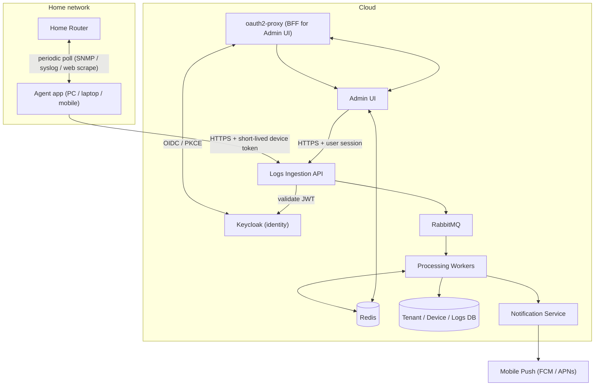

# Overview

## What the system does

HomeSecurity is a multi-tenant SaaS that collects security-relevant logs from
home routers and notifies the owning user (organization) about suspicious
activity — starting with "a new device joined your network that we don't
recognize."

Routers themselves are not expected to talk to the cloud directly. Instead, a
small **agent application** runs on a device already inside the home network
(a PC, a laptop, or a mobile phone) and periodically pulls logs from the
router on the user's behalf, then forwards them to the cloud ingestion API.
See [`05-agents-and-ingestion.md`](05-agents-and-ingestion.md) for details.

## System context

## Components

| Component | Role | Built how |
|---|---|---|
| Keycloak | Identity provider for human users (login, MFA, password reset) | Ready container, config-as-code |
| oauth2-proxy | Backend-for-Frontend: does the OIDC login dance so the browser never holds a raw token | Ready container, config only |
| Admin UI | Lets a user manage their organization, devices, and view alerts | Custom (this is the product) |
| Logs Ingestion API | Accepts log batches from agents, validates, publishes to the queue | Custom, thin |
| RabbitMQ | Message bus: decouples ingestion from processing, carries domain events | Ready container |
| Redis | Caches computed permissions; gives the Processing Worker idempotency against redelivered messages | Ready container |
| Processing Workers | Enrich, deduplicate, apply detection rules, raise incidents | Custom (this is the product) |
| Notification Service | Turns incidents into push notifications | Custom, thin, delegates to FCM/APNs |
| Tenant / Device / Logs DB | Canonical store for organizations, devices, events | Postgres |
| Agent app | Runs in the home network, polls the router, forwards logs | Custom, deliberately simple |

The rule of thumb throughout: **if it's about identity, sessions, or the login
handshake, it should be a ready container we configure. If it's about routers,
devices, or detection logic, it's the actual product and we write it.**

## Related documents

- Tenant/data isolation: [`02-multi-tenancy.md`](02-multi-tenancy.md)
- Auth for humans and for agents: [`03-security-and-identity.md`](03-security-and-identity.md)
- Roles/permissions: [`04-roles-and-permissions.md`](04-roles-and-permissions.md)
- Agents and ingestion: [`05-agents-and-ingestion.md`](05-agents-and-ingestion.md)
- Notifications: [`06-notifications.md`](06-notifications.md)
- Caching and idempotency (Redis): [`07-caching-and-idempotency.md`](07-caching-and-idempotency.md)
- API contracts and client codegen (JSON Schema): [`08-api-contracts-and-codegen.md`](08-api-contracts-and-codegen.md)
- Logging, health checks, metrics, and tracing: [`09-observability.md`](09-observability.md)
- Frontend (Admin UI): [`10-frontend.md`](10-frontend.md)
