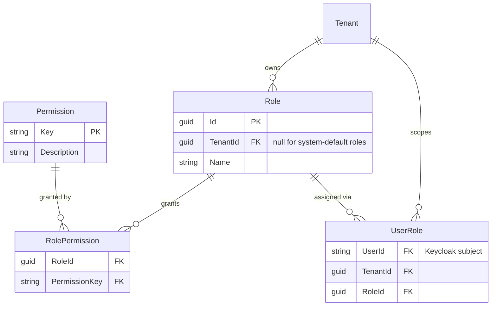

# Roles & Permissions

The permission model is inspired by the pattern used by TeamCity, GitLab, and
Jira: a fixed **catalog of atomic permissions**, and **roles are just named,
customizable bundles of those permissions**. This keeps the mechanism fully
generic while still letting each organization tailor who can do what.

## Data model

Four tables cover the whole thing:

- **Permission** — the fixed catalog: atomic, opaque strings like
  `device_credential.view`, `device_credential.delete` (the agent-auth
  credential from [ADR-0004](../decisions/0004-device-agent-authentication.md)),
  `logs.view`, `org.manage_members`, `router.view`, `router.manage`,
  `device.view`, `device.manage` (the network device from
  [`06-notifications.md`](06-notifications.md); no delete — arrival-only
  model, see [`15-router-credentials.md`](15-router-credentials.md)).
  `device_credential.*` and `device.*` were deliberately kept as two
  distinct pairs rather than one reused `device.*` pair for both meanings —
  a role already granted view access to one shouldn't silently gain it for
  the other. Seeded once at deploy time (a migration/seed script), owned by
  whoever builds the product feature that needs a new permission — this
  catalog is centrally seeded by `Org.Service` even for keys that gate a
  different service's endpoints (see "Checking a permission from a service
  that doesn't own this data" below).
- **Role** — just a name. A handful of **system-default roles** ship out of
  the box (`Owner`, `Admin`, `Member`, `Viewer`) so nobody is forced to build
  roles from scratch, but any organization can also define its own custom
  roles as an arbitrary set of permissions — exactly like TeamCity.
- **RolePermission** — the join table: which permission keys a role grants.
- **UserRole** — which role a user holds, scoped to a specific tenant. The
  same person can hold different roles in different organizations.

## Why this is "generic"

The mechanism (a role is a bag of permission-keys; checking access is one
join) doesn't know or care what `device_credential.delete` *means*. Only the
catalog's *contents* are product-specific. That means:

- The role/permission engine (these four tables + the CRUD to manage them)
  could be lifted into a reusable auth-platform with zero changes.
- Only the **seed data** — the actual list of permission keys HomeSecurity
  cares about — is specific to this product.

(Splitting that engine into its own repo is deliberately postponed — see
[ADR-0006](../decisions/0006-defer-auth-platform-extraction.md).)

## Checking a permission

"Can user X do `device_credential.delete` in org Y?" is one query: find the
user's role(s) in org Y, check whether any of them grants
`device_credential.delete`. No rules engine, no per-permission custom logic.

In practice we don't want a DB join on every request, so the effective
permission set for (user, tenant) is computed once at login/session start and
cached (or embedded in the session), and invalidated when role assignments
change.

## Checking a permission from a service that doesn't own this data

The check above assumes direct SQL access to `UserRole`/`RolePermission` —
true for `Org.Service`, which owns those tables, but not for a service like
`Devices.Service` that has its own separate database (see
[ADR-0016](../decisions/0016-devices-service-owns-its-own-database.md)).
That service still needs to answer "does this user have `router.manage`",
so the check is split behind one abstraction
(`IPermissionSourceLoader`/`PermissionEvaluator` in the shared
`Dzaba.HomeSecurity.Authorization` library) with two implementations:

- **`Org.Service`**: queries `Membership`/`UserRole`/`RolePermission`
  directly — the same query as above.
- **Any other service**: calls `Org.Service`'s
  `GET /api/v1/orgs/{orgId}/access-context` (forwarding its own caller's
  bearer token), and only does that on a genuine miss against the same
  shared Redis cache `Org.Service` already populates — see
  [`07-caching-and-idempotency.md`](07-caching-and-idempotency.md). Neither
  implementation's caller needs to know which one is behind the interface.

## Namespacing (future-proofing, not needed yet)

With a single product, permission keys are unprefixed (`device_credential.delete`).
If this permission engine is ever shared by more than one product, keys
should be namespaced (`homesecurity:device_credential.delete`) to avoid
collisions — cheap to add later, not worth doing prematurely with one
product.

## Alternative considered and rejected: Keycloak Authorization Services

Keycloak ships a full fine-grained authorization engine (resources, scopes,
policies, permissions — UMA2). It's genuinely more "no-code," but it pushes
business logic into Keycloak configuration, has a steep learning curve, and
blurs the line we're otherwise keeping clean (Keycloak = identity only,
never product authorization). Evaluated and rejected in favor of the simple
table-based model above.
