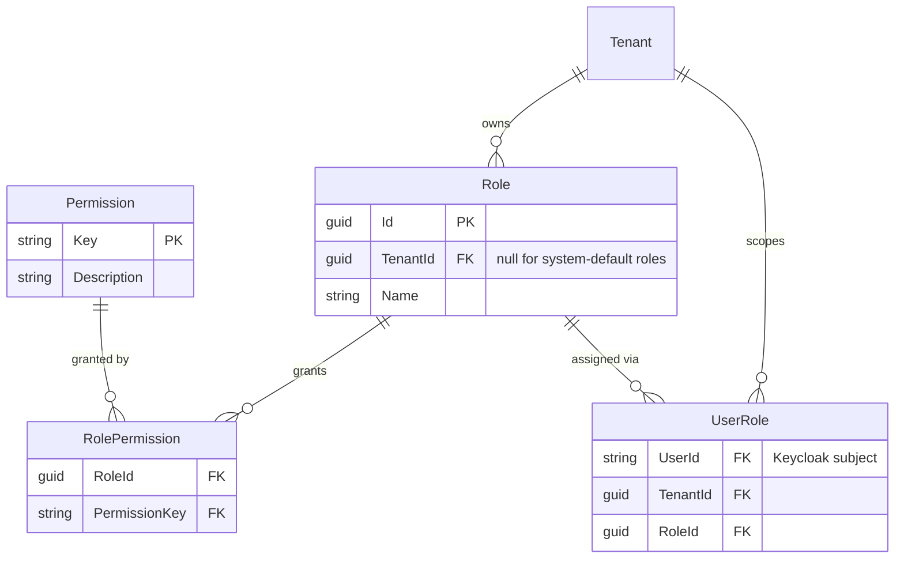

# Roles & Permissions

The permission model is inspired by the pattern used by TeamCity, GitLab, and
Jira: a fixed **catalog of atomic permissions**, and **roles are just named,
customizable bundles of those permissions**. This keeps the mechanism fully
generic while still letting each organization tailor who can do what.

## Data model

Four tables cover the whole thing:

- **Permission** — the fixed catalog: atomic, opaque strings like
  `device.view`, `device.delete`, `logs.view`, `org.manage_members`. Seeded
  once at deploy time (a migration/seed script), owned by whoever builds the
  product feature that needs a new permission.
- **Role** — just a name. A handful of **system-default roles** ship out of
  the box (`Owner`, `Admin`, `Member`, `Viewer`) so nobody is forced to build
  roles from scratch, but any organization can also define its own custom
  roles as an arbitrary set of permissions — exactly like TeamCity.
- **RolePermission** — the join table: which permission keys a role grants.
- **UserRole** — which role a user holds, scoped to a specific tenant. The
  same person can hold different roles in different organizations.

## Why this is "generic"

The mechanism (a role is a bag of permission-keys; checking access is one
join) doesn't know or care what `device.delete` *means*. Only the catalog's
*contents* are product-specific. That means:

- The role/permission engine (these four tables + the CRUD to manage them)
  could be lifted into a reusable auth-platform with zero changes.
- Only the **seed data** — the actual list of permission keys HomeSecurity
  cares about — is specific to this product.

(Splitting that engine into its own repo is deliberately postponed — see
[ADR-0006](../decisions/0006-defer-auth-platform-extraction.md).)

## Checking a permission

"Can user X do `device.delete` in org Y?" is one query: find the user's
role(s) in org Y, check whether any of them grants `device.delete`. No rules
engine, no per-permission custom logic.

In practice we don't want a DB join on every request, so the effective
permission set for (user, tenant) is computed once at login/session start and
cached (or embedded in the session), and invalidated when role assignments
change.

## Namespacing (future-proofing, not needed yet)

With a single product, permission keys are unprefixed (`device.delete`). If
this permission engine is ever shared by more than one product, keys should
be namespaced (`homesecurity:device.delete`) to avoid collisions — cheap to
add later, not worth doing prematurely with one product.

## Alternative considered and rejected: Keycloak Authorization Services

Keycloak ships a full fine-grained authorization engine (resources, scopes,
policies, permissions — UMA2). It's genuinely more "no-code," but it pushes
business logic into Keycloak configuration, has a steep learning curve, and
blurs the line we're otherwise keeping clean (Keycloak = identity only,
never product authorization). Evaluated and rejected in favor of the simple
table-based model above.
