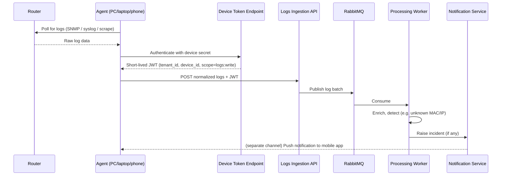

# Agents & Ingestion

## The problem

Home routers are not expected to speak to our cloud API themselves — most
consumer routers can't be extended with arbitrary outbound integrations, and
we don't want to depend on router firmware. Instead, we assume the user has
*some* always-or-often-on device already sitting inside their home network —
a PC, a laptop, or a phone — and we ship a small **agent application** for
it.

**Key assumption: the agent and the router are on the same home network.**
The agent talks to the router using whatever the router already exposes
(SNMP, syslog forwarding, or scraping the router's own admin web page) — it
never needs router vendor cooperation or a public API. It is the *agent* that
initiates outbound contact with our cloud, never the other way around, so
nothing needs to be exposed on the home network's firewall/NAT.

## Agent design principles

- **Boring on purpose.** A background service (`.NET` worker/`IHostedService`,
  or a tray app / MAUI app if a GUI is wanted for the portfolio), not a novel
  protocol. Polling on a timer is enough for router logs; no persistent
  connection is required.
- **One credential per device**, paired once during setup (see
  [`03-security-and-identity.md`](03-security-and-identity.md)), used to mint
  short-lived tokens for each upload — never a long-lived token sitting on
  disk.
- **Reuses the ingestion API contract** — the agent doesn't get its own
  bespoke wire format; it normalizes whatever it scrapes from the router into
  the same log-entry shape the Ingestion API already accepts.
- **No trust in the agent's own judgement about security events.** The agent's
  job is purely "get logs from the router to the cloud." Detection logic
  (e.g. "this MAC address has never been seen before") lives entirely in the
  cloud's Processing Workers, where it's centrally maintained, testable, and
  can evolve without redeploying every agent.

## Pairing a new device

1. User adds a device in the Admin UI, scoped to their organization.
2. Backend generates a device secret and displays/downloads it once (or via
   QR code, for the mobile case).
3. User enters that secret into the agent app on first run.
4. Agent stores the secret locally (OS credential store where available —
   Keychain / Windows Credential Manager / Android Keystore) and never
   transmits it again except to mint a new short-lived token when needed.

## End-to-end flow

## Ingestion API responsibilities (kept intentionally thin)

- Validate the device JWT (standard `JwtBearer` middleware, no custom crypto).
- Validate/normalize the payload shape.
- Publish to RabbitMQ and return quickly — no processing happens inline.

All actual log processing, enrichment, and detection logic lives in the
Processing Workers downstream, which is where the interesting, testable
product logic belongs.
