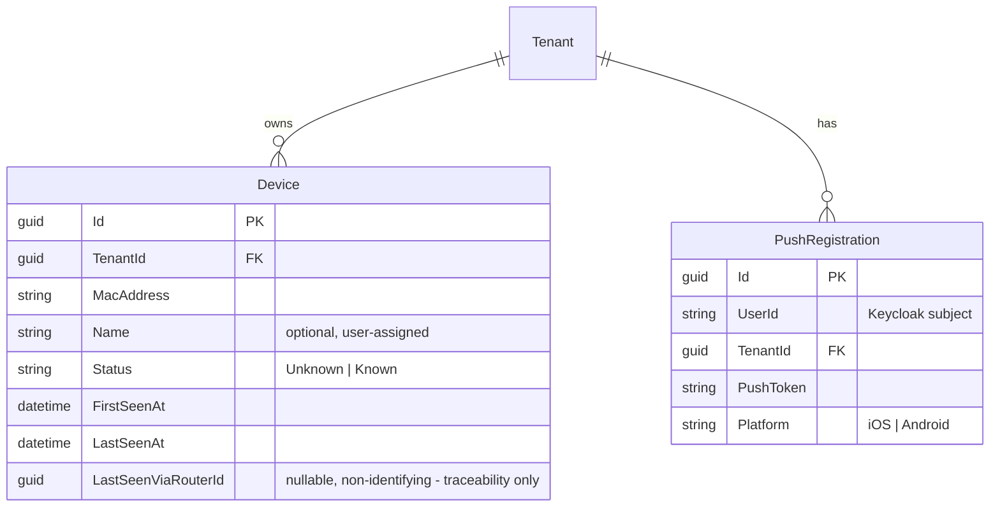
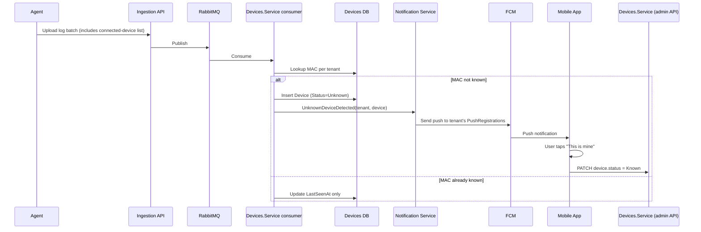

# Notifications — unknown device detected (MVP)

This is the first end-to-end product feature: notify a user's mobile device
when a device the system hasn't seen before joins their home network. It's
deliberately minimal — it exists to prove the whole pipeline (agent →
ingestion → detection → push) works, not to be a full alerting system.

## Data model

Two new tenant-scoped entities. `Device` lives in **`Devices.Service`'s own
database**, alongside `Router` — see
[`15-router-credentials.md`](15-router-credentials.md#data-model) and
[ADR-0016](../decisions/0016-devices-service-owns-its-own-database.md).
`PushRegistration` belongs to whichever service ends up owning the
Notification Service's data, not yet built:

- **`Device`** — one row per MAC address ever seen on a tenant's network.
  `MacAddress` is unique per tenant (`(TenantId, MacAddress)` is the
  identity, not `LastSeenViaRouterId`). `Status` starts at `Unknown` and
  moves to `Known` once a user acknowledges it. `LastSeenViaRouterId` is a
  nullable FK to `Router` for traceability only, written by the ingestion
  consumer described below (resolving the reporting agent's credential to
  its bound router) — no admin-facing endpoint writes it, and its absence
  doesn't mean anything about the device's own identity.
- **`PushRegistration`** — one row per (user, tenant, installed mobile app).
  A user can belong to multiple tenants and get notifications for each
  independently.

`Devices.Service`'s own admin API only ever lists/gets `Device` rows and
`PATCH`es `Name`/`Status` (see [`15-router-credentials.md`](15-router-credentials.md)
for the full endpoint table) — rows are created and `LastSeenAt`/
`LastSeenViaRouterId` updated only by the ingestion consumer below, never
by that API. Every `PATCH` also publishes a coarse `device.changed`
notification event (`{tenantId, deviceId, macAddress, status, changedAt}`)
— no consumer exists yet; see
[`07-caching-and-idempotency.md`](07-caching-and-idempotency.md#3-coarse-something-changed-notification-events).

## Detection flow

Not yet built — `Devices.Service`'s initial scope is the admin/agent CRUD
API from [`15-router-credentials.md`](15-router-credentials.md), not this
consumer (see [ADR-0016](../decisions/0016-devices-service-owns-its-own-database.md)'s
"CRUD only for now" framing). Documented here as the target design the
`Device` schema above is already shaped for.

The agent already reports the router's currently-connected device list
(MAC/IP/hostname) as part of its periodic log upload (see
[`05-agents-and-ingestion.md`](05-agents-and-ingestion.md)). The Processing
Worker does the comparison:

1. For each reported MAC address for a tenant:
   - If no `Device` row exists yet → insert one with `Status = Unknown`,
     `FirstSeenAt = now`, and raise an `UnknownDeviceDetected` event.
   - If a row exists → just update `LastSeenAt`. No event, no repeated
     notification for devices already known about.
2. Nothing here is agent-side logic — the agent only reports what it sees;
   all detection state and rules live centrally in the Worker, so the rule can
   evolve without touching every deployed agent.

This is intentionally the *only* detection rule for the MVP. No allow-lists,
no "leave network" events, no anomaly scoring — just "have we ever seen this
MAC before for this tenant."

## Push delivery: Firebase Cloud Messaging (FCM) only

We use **FCM** as the single push integration for both Android and iOS. FCM
forwards messages to APNs on Apple's behalf, so there's one API, one SDK, one
set of credentials to manage instead of separate FCM/APNs integrations. The
Notification Service's job on `UnknownDeviceDetected` is:

1. Look up all `PushRegistration`s for the event's `TenantId`.
2. Call the FCM send API with a message identifying the device (MAC, first
   seen time) for each registration.

No custom push infrastructure, retry queues, or delivery tracking for v1 —
FCM's own delivery guarantees are enough at this scale.

## End-to-end flow

`W` below is a consumer that has to live inside `Devices.Service` itself
once built, not a separate "Processing Workers" service reaching into
`Devices.Service`'s own database from outside — same reasoning as
[`01-overview.md`](01-overview.md#system-context)'s note on this. The
mobile app's write also targets `Devices.Service`, not the Ingestion API —
it never touches ingestion at all.

## Mobile app's minimal responsibility

For this feature, the mobile app needs exactly three things:

1. Register its FCM token against the logged-in user + tenant on app start
   (`PushRegistration` upsert).
2. Render the incoming push notification (device MAC, first-seen time).
3. One action: **"This is mine"**, which calls a simple API endpoint to set
   `Device.Status = Known`. This is the only write path needed for v1 — it's
   what stops future notifications for that device.

## Explicitly out of scope for v1

- Blocking/quarantining a device on the router itself (we only *observe*
  logs, we don't control the router).
- Per-device notification preferences, quiet hours, or digesting/aggregating
  multiple unknown devices into one notification.
- Naming/tagging known devices beyond the optional `Name` field.
- Any notification channel besides push (no email/SMS fallback yet).

These are natural follow-ups once the base pipeline is proven, not because
they're hard — they're deferred to keep the first working slice small.

## Alternatives considered

- **Separate FCM (Android) + APNs (iOS) integrations** — rejected; FCM already
  proxies to APNs, so maintaining two integrations would be pure duplicated
  code for no benefit.
- **In-app polling instead of push** — rejected as the primary channel; the
  point of the feature is to alert the user promptly even when the app isn't
  open. Polling could still be a fallback for viewing history, but isn't
  needed for the notification itself.
