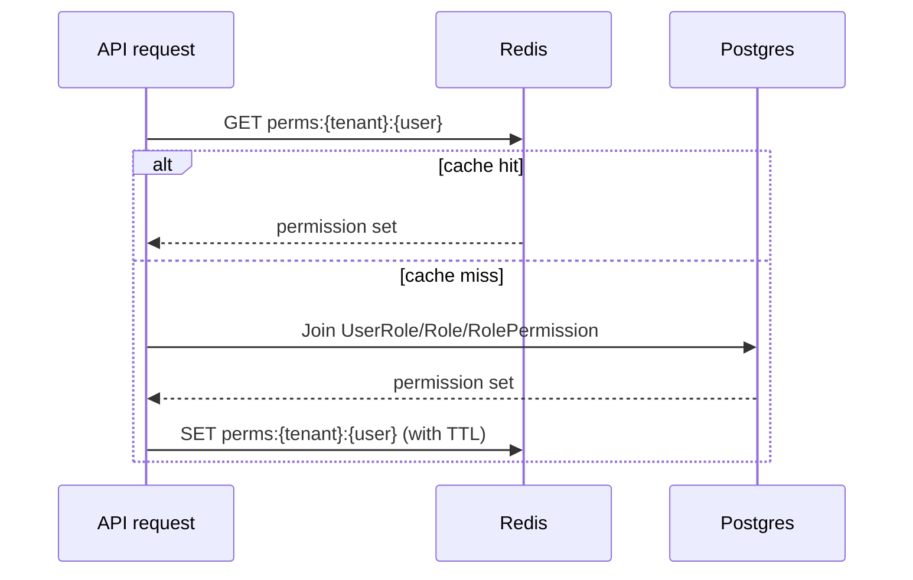
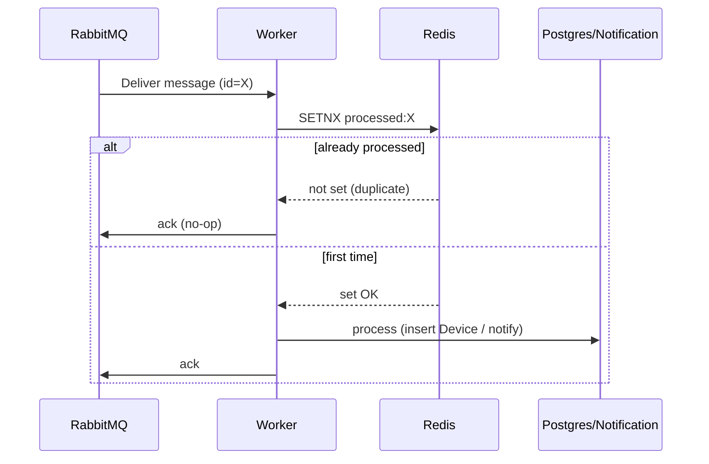

# Caching & Idempotency (Redis)

Redis shows up in two places in this system, both solving a real problem
rather than being added for its own sake. Both were flagged as needed by
earlier decisions before Redis itself was chosen as the tool:

1. Caching the permission lookup from
   [`04-roles-and-permissions.md`](04-roles-and-permissions.md).
2. Making the Processing Worker safe against RabbitMQ's at-least-once
   delivery (see [ADR-0007](../decisions/0007-rabbitmq-as-message-bus.md)).

Two other candidate uses (rate limiting the ingestion endpoint, caching the
known-MAC set per tenant) are documented at the bottom as designed-but-not-
built-yet, to keep the first version focused.

## 1. Permission cache

### The problem

Checking "does this user have permission X in this tenant" is a join across
`UserRole` → `Role` → `RolePermission` (see
[`04-roles-and-permissions.md`](04-roles-and-permissions.md)). That's fine
once, but every authenticated API call needs this answer, and re-joining on
every request is wasted DB load for data that changes rarely.

### The approach

Compute a user's **effective permission set for a tenant** once, cache it in
Redis, and reuse it for the lifetime of that cache entry:

- **Key**: `perms:{tenantId}:{userId}`
- **Value**: the set of permission keys the user currently holds in that
  tenant
- **Populated**: on first check after cache miss (compute via the DB join,
  write to Redis)
- **Invalidated**: explicitly, whenever that user's role assignment changes
  in that tenant (role added/removed, or a role's permission set edited) —
  not relied upon to expire on its own, though a TTL (e.g. 15 minutes) is
  still set as a safety net in case an invalidation is ever missed.

## 2. Idempotent event processing

### The problem

RabbitMQ (like any broker used sanely) gives **at-least-once** delivery: a
message can be redelivered after a consumer crash, a slow ack, or a network
blip, even if it was already fully processed. Without protection, a
redelivered `UnknownDeviceDetected`-triggering log batch could:

- insert the same `Device` row twice (mitigated by a DB unique constraint,
  but that only prevents corruption, not a duplicate push notification), or
- fire a second, duplicate push notification for the same device to the
  same user.

### The approach

Each message carries a unique message id (already standard practice for
anything published to RabbitMQ). Before doing any side-effecting work, the
consumer does a Redis `SETNX` (set-if-not-exists) on that id with a TTL long
enough to cover the broker's redelivery window:

- `SETNX processed:{messageId} 1 EX 3600` → if it returns "already set," the
  message has been handled before; ack and skip.
- If it returns "newly set," proceed with processing as normal.

This turns "at-least-once delivery" into "effectively-once side effects"
without needing exactly-once semantics from the broker itself — a standard,
well-understood pattern, not a custom-built one.

## Designed but not built for v1

Kept here so the reasoning isn't lost, not because they're needed yet:

- **Rate limiting the ingestion endpoint** — a Redis-backed sliding-window or
  token-bucket limiter per device, to bound how often a single (possibly
  compromised or misbehaving) agent can call the Ingestion API. Not needed
  while there's no real traffic to abuse, but the natural place to add it
  when it matters.
- **Known-MAC lookup cache** — caching each tenant's set of known MACs in
  Redis (`known_macs:{tenantId}` as a Redis Set) so the detection rule in
  [`06-notifications.md`](06-notifications.md) doesn't hit Postgres for every
  reported device on every poll cycle. Worth adding once real device volume
  makes the DB lookup show up as a cost.

## Related documents

- Why a single Redis instance is enough for both uses today, and what
  Redis Cluster would be for: [`14-scalability.md`](14-scalability.md#the-real-bottleneck-stateful-dependencies-not-the-stateless-pods)
