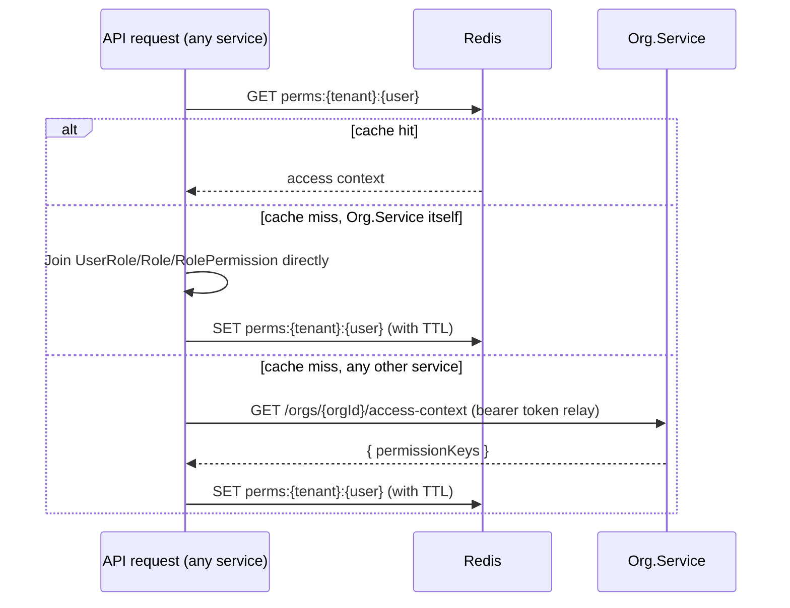
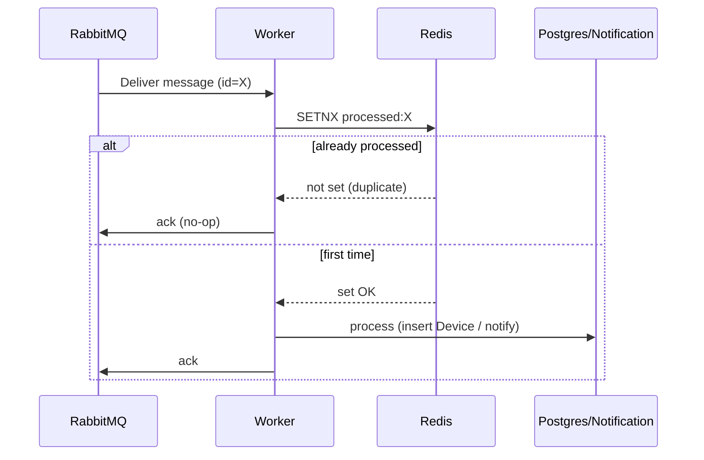

# Caching & Idempotency (Redis)

Redis shows up in two places in this system, both solving a real problem
rather than being added for its own sake. Both were flagged as needed by
earlier decisions before Redis itself was chosen as the tool:

1. Caching the permission lookup from
   [`04-roles-and-permissions.md`](04-roles-and-permissions.md).
2. Making the Processing Worker safe against RabbitMQ's at-least-once
   delivery (see [ADR-0007](../decisions/0007-rabbitmq-as-message-bus.md)).

Two other candidate uses (rate limiting the ingestion endpoint, caching the
known-MAC set per tenant) are documented at the bottom as designed-but-not-
built-yet, to keep the first version focused. A third, RabbitMQ-based
mechanism directly tied to (1) — coarse "something changed" notification
events — is documented at the end too, since it only makes sense alongside
the permission cache it's a hedge for.

## 1. Permission cache

### The problem

Checking "does this user have permission X in this tenant" is a join across
`UserRole` → `Role` → `RolePermission` (see
[`04-roles-and-permissions.md`](04-roles-and-permissions.md)). That's fine
once, but every authenticated API call needs this answer, and re-joining on
every request is wasted DB load for data that changes rarely.

This cache started as an `Org.Service`-internal optimization, but it's now
genuinely **cross-service shared infrastructure**: a service that doesn't
own `UserRole`/`RolePermission` directly (see
[ADR-0016](../decisions/0016-devices-service-owns-its-own-database.md))
reads and populates the exact same Redis keys `Org.Service` does, rather
than having its own separate cache.

### The approach

Compute a user's **effective access for a tenant** once, cache it in Redis,
and reuse it for the lifetime of that cache entry:

- **Key**: `perms:{tenantId}:{userId}`
- **Value**: the set of permission keys the user currently holds in that
  tenant, plus one reserved sentinel member meaning "not a member of this
  tenant at all" — one cache entry answers both "is this user a member"
  (tenant resolution) and "does this user have permission X"
  (authorization) from the same round-trip.
- **Populated**: on first check after cache miss, via
  `IPermissionSourceLoader` (`Dzaba.HomeSecurity.Authorization`) — `Org.Service`
  implements this by querying `UserRole`/`RolePermission` directly; any
  other service implements it by calling `Org.Service`'s
  `GET /api/v1/orgs/{orgId}/access-context` instead (forwarding its own
  caller's bearer token — no new service-account auth scheme). See
  [`04-roles-and-permissions.md`](04-roles-and-permissions.md#checking-a-permission-from-a-service-that-doesnt-own-this-data).
- **Invalidated**: explicitly, whenever that user's role assignment changes
  in that tenant (role added/removed, or a role's permission set edited) —
  not relied upon to expire on its own, though a TTL (e.g. 15 minutes) is
  still set as a safety net in case an invalidation is ever missed.

A cache miss reached by a service other than `Org.Service` is a genuine
runtime dependency on `Org.Service`'s availability — accepted explicitly in
[ADR-0016](../decisions/0016-devices-service-owns-its-own-database.md),
not hidden.

## 2. Idempotent event processing

### The problem

RabbitMQ (like any broker used sanely) gives **at-least-once** delivery: a
message can be redelivered after a consumer crash, a slow ack, or a network
blip, even if it was already fully processed. Without protection, a
redelivered `UnknownDeviceDetected`-triggering log batch could:

- insert the same `Device` row twice (mitigated by a DB unique constraint,
  but that only prevents corruption, not a duplicate push notification), or
- fire a second, duplicate push notification for the same device to the
  same user.

### The approach

Each message carries a unique message id (already standard practice for
anything published to RabbitMQ). Before doing any side-effecting work, the
consumer does a Redis `SETNX` (set-if-not-exists) on that id with a TTL long
enough to cover the broker's redelivery window:

- `SETNX processed:{messageId} 1 EX 3600` → if it returns "already set," the
  message has been handled before; ack and skip.
- If it returns "newly set," proceed with processing as normal.

This turns "at-least-once delivery" into "effectively-once side effects"
without needing exactly-once semantics from the broker itself — a standard,
well-understood pattern, not a custom-built one.

Not every consumer uses Redis for this: `Audit.Service` dedupes with a unique
index on the event id in its own database instead, since the database is the
store of record there and adding a Redis check in front would only add a
Redis-outage failure mode (see
[`16-auditing-and-compliance.md`](16-auditing-and-compliance.md#3-architecture-one-more-subscriber-on-the-existing-bus)).

## 3. Domain events instead of "something changed" notifications

Separate from both uses above: every operation `Org.Service` and
`Devices.Service` perform on their own data is published to RabbitMQ as one
domain event named for what happened — `membership.added`, `role.assigned`,
`router.updated`, `device.updated`, … — with the extended data of that
operation in a common envelope (`domain_event_message.json`; the full list
and the audit use are in
[`16-auditing-and-compliance.md`](16-auditing-and-compliance.md)). They
replace the earlier coarse `access.changed`/`router.changed`/`device.changed`
notifications: **no consumer of those ever existed**, and a domain event
carries everything they did and more, so a service publishes one message per
operation rather than two. `Audit.Service` is the first subscriber; a cache
warmer or another product would be another, binding just the event names it
cares about — the same "publish now, consume later" precedent
`LogsIngestion.Service` set with `logs.ingested` (see
[ADR-0007](../decisions/0007-rabbitmq-as-message-bus.md)).

These are still deliberately **not event-carried state transfer**: an event
says what happened and (in `metadata`) what changed — a role's added and
removed permission keys, a router's name from/to — never "here is the whole
new state." A subscriber that needs current data still calls the owning
service's API (or reads the shared permission cache), which keeps the owning
service the single source of truth and avoids ever having two divergent
copies of "what this user can do" or "what this router's config is." See
[ADR-0016](../decisions/0016-devices-service-owns-its-own-database.md) for
why this exists alongside, not instead of, the permission cache's
call-through mechanism above.

Events are published inline after the change has been saved, so a broker
outage while publishing fails the request with the change already committed;
that is accepted for now (see
[ADR-0020](../decisions/0020-audit-log-and-iso27701-compliance-model.md)).

## Designed but not built for v1

Kept here so the reasoning isn't lost, not because they're needed yet:

- **Rate limiting the ingestion endpoint** — a Redis-backed sliding-window or
  token-bucket limiter per device, to bound how often a single (possibly
  compromised or misbehaving) agent can call the Ingestion API. Not needed
  while there's no real traffic to abuse, but the natural place to add it
  when it matters.
- **Known-MAC lookup cache** — caching each tenant's set of known MACs in
  Redis (`known_macs:{tenantId}` as a Redis Set) so the detection rule in
  [`06-notifications.md`](06-notifications.md) doesn't hit Postgres for every
  reported device on every poll cycle. Worth adding once real device volume
  makes the DB lookup show up as a cost.

## Related documents

- Why a single Redis instance is enough for all of these uses today, and
  what Redis Cluster would be for: [`14-scalability.md`](14-scalability.md#the-real-bottleneck-stateful-dependencies-not-the-stateless-pods)
