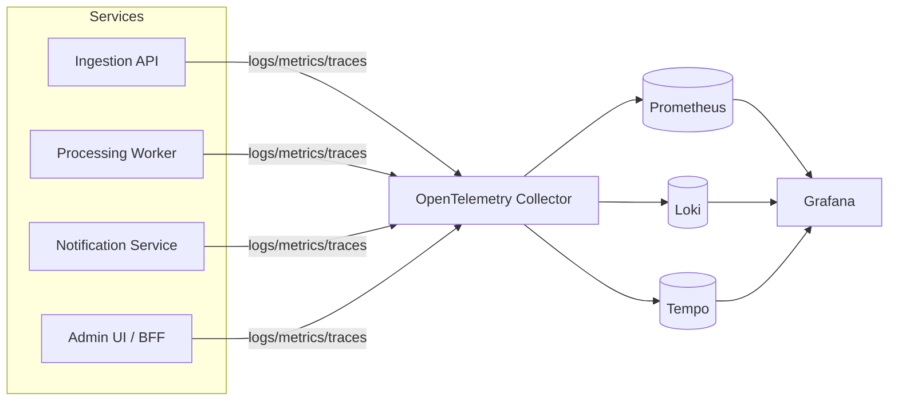

# Observability — Logging, Health Checks, Metrics, Tracing

Health checks, logging, and metrics are cross-cutting concerns every service
in this design needs (Ingestion API, Processing Workers, Notification
Service, Admin UI/BFF), and this document is the one place that settles what
gets logged, how health is reported, and how metrics/traces get out of the
process — all built on ready-made libraries per the project's first
principle, not hand-rolled.

The stack choice itself (Serilog + OpenTelemetry + Prometheus + Grafana) is
recorded as [ADR-0009](../decisions/0009-observability-stack.md); this
document covers how each piece is actually used.

## Why this is one cross-cutting document, not four

Logging, health, metrics, and tracing all answer the same underlying
question — "is the system doing what it should, and if not, where did it
break?" — and in this system that question is inherently cross-process: a
single unit of work (an agent's log upload) crosses the Ingestion API,
RabbitMQ, a Processing Worker, and the Notification Service. None of the four
pillars are useful in isolation here; a log line without a trace id, or a
health check that only reports "the process is running" and not "the queue
this process depends on is reachable," doesn't answer the real question.

## 1. Structured logging (Serilog)

Every service uses **Serilog** (per [`CLAUDE.md`](../../CLAUDE.md)) configured
for structured (JSON) output, not hand-formatted message strings:

- **Sinks**: console only, in every environment. Container runtimes/Kubernetes
  already capture stdout; shipping (to Loki or an equivalent) is an
  infrastructure concern (a log-forwarding sidecar/daemonset such as Promtail
  or Fluent Bit), not something each service configures for itself.
- **Enrichers**, applied uniformly:
  - `tenant_id` and `user_id` (or `device_id` for agent-authenticated calls),
    pulled from the authenticated identity ([`03-security-and-identity.md`](03-security-and-identity.md)),
    never from a client-supplied claim on its own. Since multi-tenancy here is
    "shared database, filtered in code" ([`02-multi-tenancy.md`](02-multi-tenancy.md)),
    tenant-tagged logs are the first place to look when a tenant-leak bug is
    suspected.
  - `trace_id`/`span_id` (see [§4](#4-distributed-tracing-opentelemetry)), so
    a log line can always be pivoted to the full trace and back.
  - `service_name` and `environment`, for filtering once logs from multiple
    services land in one place.
- **What never gets logged**: device secrets, JWTs/bearer tokens (human or
  device), Keycloak credentials, or raw router log payloads verbatim — router
  logs describe a user's home network and are treated as sensitive by
  default. Serilog's destructuring is explicitly *not* used on request/command
  objects that might carry any of these; fields are logged individually and
  denylisted fields are never included.
- **Log levels**: `Information` for one line per meaningful business event
  (log batch accepted, `UnknownDeviceDetected` raised, push sent),
  `Warning`/`Error` for anything the dead-letter-queue policy in
  [ADR-0007](../decisions/0007-rabbitmq-as-message-bus.md) would also flag,
  `Debug` for anything noisier — off by default in production.

## 2. Health checks

Every ASP.NET Core service (Ingestion API, Admin UI/BFF, Notification
Service) and worker process exposes health via
**`Microsoft.Extensions.Diagnostics.HealthChecks`**, using the community
`AspNetCore.HealthChecks.*` packages for each dependency rather than
hand-written probes:

- **`/health/live`** — liveness: the process itself is up and not deadlocked.
  No dependency calls. Kubernetes restarts the pod if this fails.
- **`/health/ready`** — readiness: the process can actually serve traffic,
  checking each dependency it needs:
  - Ingestion API: Postgres (`AspNetCore.HealthChecks.NpgSql`), RabbitMQ
    (`AspNetCore.HealthChecks.Rabbitmq`).
  - Processing Worker: Postgres, RabbitMQ, Redis
    (`AspNetCore.HealthChecks.Redis`).
  - Notification Service: Postgres, RabbitMQ, and an FCM reachability check.
  - Admin UI/BFF: the Ingestion/Tenant API, Redis, and Keycloak's discovery
    endpoint.

  Kubernetes stops routing traffic to a pod that fails readiness, without
  restarting it — the standard distinction, and the reason liveness and
  readiness are always two separate endpoints rather than one `/health`.
- Both endpoints are unauthenticated (they're an operational surface, not a
  product one) but are only ever reachable from inside the cluster —
  never exposed through the public HTTPS edge from
  [ADR-0008](../decisions/0008-https-everywhere.md).

## 3. Metrics (OpenTelemetry → Prometheus)

Each service uses the **OpenTelemetry .NET SDK**'s Metrics API, with the
built-in ASP.NET Core, HTTP client, and .NET runtime instrumentation
packages, exported via the **Prometheus exporter** on a `/metrics` endpoint
that a Prometheus server scrapes — the standard pull-based pattern, no
custom metrics pipeline.

Beyond the instrumentation packages' defaults (request latency, status
codes, GC/thread-pool stats), a small set of domain counters/histograms are
added by hand where the built-ins can't see the business event:

- `homesecurity_log_batches_ingested_total` (Ingestion API, tagged by
  `tenant_id` cardinality kept low by *not* tagging per-device)
- `homesecurity_unknown_device_events_total` (Processing Worker)
- `homesecurity_push_notifications_sent_total` /
  `_failed_total` (Notification Service)
- `homesecurity_rabbitmq_message_processing_duration_seconds` (Processing
  Worker), the practical early-warning signal for consumer lag before it
  shows up as a user-visible delay.

## 4. Distributed tracing (OpenTelemetry)

Because a single log upload fans out across process boundaries connected by
a queue rather than a direct call (agent → Ingestion API → RabbitMQ →
Processing Worker → Notification Service — see
[`05-agents-and-ingestion.md`](05-agents-and-ingestion.md)), a trace only
tells the full story if the trace context survives the hop through RabbitMQ:

- ASP.NET Core and the RabbitMQ client are both instrumented via
  OpenTelemetry's standard instrumentation packages.
- The **W3C `traceparent`** context is propagated as a RabbitMQ message
  header when publishing, and extracted by the consumer to continue the same
  trace rather than starting a new one — this is what makes "one agent
  upload" show up as one trace spanning four services instead of four
  disconnected ones.
- Traces are exported via **OTLP** to an OpenTelemetry Collector, which fans
  out to a tracing backend (Tempo or Jaeger — either is a ready-made
  container, not a build choice this document needs to lock in yet).

## Designed but not built for v1

Kept here so the reasoning isn't lost, not because they're needed on day one:

- **Alerting rules** (Prometheus Alertmanager or Grafana-managed alerts) on
  the metrics above — e.g. RabbitMQ dead-letter queue depth > 0, or push
  failure rate over a threshold. Worth adding once there's an on-call
  audience for them.
- **Security/audit logging as a distinct stream** from operational logging
  above (who changed which role, who added/removed a device) — flagged
  during [ADR-0007](../decisions/0007-rabbitmq-as-message-bus.md)'s
  discussion as a Keycloak-events-to-webhook idea, but not yet designed in
  detail. Operational logging (this document) answers "is the system
  healthy"; audit logging answers "who did what" and has different retention
  and access-control requirements, so it deserves its own design rather than
  being folded into Serilog's output.
- **Log-based SLOs** (e.g. "99% of log batches processed within N seconds")
  once real traffic makes a target meaningful to set.

## Related documents

- Logging stack decision: [ADR-0009](../decisions/0009-observability-stack.md)
- Multi-tenancy (why `tenant_id` is a required log enricher): [`02-multi-tenancy.md`](02-multi-tenancy.md)
- Identity (where `user_id`/`device_id` come from, and why raw tokens are
  never logged): [`03-security-and-identity.md`](03-security-and-identity.md)
- Agents & ingestion (the multi-hop flow tracing has to survive):
  [`05-agents-and-ingestion.md`](05-agents-and-ingestion.md)
- RabbitMQ as the message bus, and its dead-letter-queue failure policy:
  [ADR-0007](../decisions/0007-rabbitmq-as-message-bus.md)
- HTTPS-only edge (why `/health/*` isn't exposed through it):
  [ADR-0008](../decisions/0008-https-everywhere.md)
