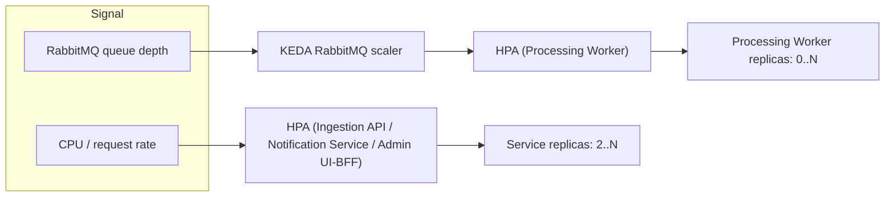

# Horizontal Scalability

## How this differs from "high availability"

[`11-deployment-and-availability.md`](11-deployment-and-availability.md) fixes
the *floor*: every service runs at least 2 replicas so a rolling deploy or a
node drain never drops capacity to zero. That document is about **never going
below** enough capacity to stay up. This one is about **going above** it on
purpose — adding replicas because there's more load to handle, and removing
them again when there isn't. Both rely on the same precondition (every
service is a stateless Kubernetes `Deployment`,
[ADR-0011](../decisions/0011-zero-downtime-rolling-deployments.md)), but they
answer different questions and are configured independently: the replica
*floor* is a fixed number set for uptime; the replica *range* on top of it is
driven by load.

## Each service scales on a different signal

A blanket "add more pods" rule doesn't work here because the services don't
bottleneck on the same resource. Two shapes show up in this system:

### Request-driven services: standard `HorizontalPodAutoscaler`, CPU/RPS-based

The Ingestion API, Notification Service, and Admin UI/BFF all handle
synchronous inbound calls, so load shows up directly as CPU and request rate
on the pod. These use a plain Kubernetes **`HorizontalPodAutoscaler`** (HPA)
against CPU utilization (and, once the metrics exist to justify it, a custom
Prometheus metric such as request rate) — no extra component, HPA already
ships with Kubernetes:

```yaml
minReplicas: 2   # the HA floor from 11-deployment-and-availability.md
maxReplicas: 10  # tuned per environment/service
targetCPUUtilizationPercentage: 70
```

### Queue-driven service: KEDA, RabbitMQ queue length-based

The Processing Worker doesn't serve requests at all — it pulls from a
RabbitMQ queue ([ADR-0007](../decisions/0007-rabbitmq-as-message-bus.md)), so
its CPU can sit idle while a large backlog is queuing up (e.g. a burst of
agents polling at the same time of day), which is exactly when it needs more
replicas. A plain CPU-based HPA is blind to that. Plain HPA also can't read a
RabbitMQ queue depth on its own — it needs a metrics source that understands
the broker.

Per the project's first principle (prefer a ready-made component over custom
code), this uses **[KEDA](https://keda.sh)** and its built-in RabbitMQ
scaler, rather than hand-rolling a controller that polls the queue and calls
the Kubernetes API:

- Scales Processing Worker replicas directly on **queue message count**
  (`rabbitmq` scaler, `queueLength` trigger) — the actual backlog, not a
  proxy for it.
- Can scale **to zero** when the queue is empty for a configurable cooldown,
  which a plain HPA cannot do (HPA requires `minReplicas >= 1`) — a real cost
  saving for a portfolio-scale system that's idle most of the time in
  non-production environments. Production keeps a `minReplicas` floor for the
  same HA reason as every other service.
- KEDA installs as a normal operator (CRDs + a small controller) and is
  itself just a driver for the standard HPA underneath — it doesn't replace
  Kubernetes autoscaling, it feeds it a metric HPA can't read on its own.



## The real bottleneck: stateful dependencies, not the stateless pods

Adding pod replicas is cheap and is the easy part; it only helps up to the
point where every replica is waiting on the same shared, stateful dependency.
This system has exactly three stateful components, and none of them scale
just because a `Deployment` does:

- **Postgres** ([ADR-0002](../decisions/0002-shared-database-multi-tenancy.md)).
  Every replica of every service opens its own connection pool (Npgsql's
  default pooling). Replica count × per-pod pool size can exceed Postgres's
  `max_connections` well before CPU/memory on the pods becomes the limit —
  this is the most likely way "we added replicas and it didn't get faster"
  actually happens here. Not a problem at current traffic, and not solved
  today; when it becomes one, the ready-made fix is **PgBouncer** in front of
  Postgres (connection pooling at the proxy, not per-pod), not a rewrite of
  how any service talks to the database. Read-heavy scaling beyond that
  (read replicas) is a later step, and only worth it once a real read-heavy
  hot path shows up — most of this system's read load is already absorbed by
  the Redis permission cache
  ([`07-caching-and-idempotency.md`](07-caching-and-idempotency.md)).
- **RabbitMQ** ([ADR-0007](../decisions/0007-rabbitmq-as-message-bus.md)). A
  single broker instance comfortably handles this system's throughput; it
  isn't the bottleneck consumer replicas compete for. If broker throughput or
  broker availability ever becomes the limit, RabbitMQ's own clustering with
  quorum queues is the ready-made answer — not a second broker technology.
- **Redis** ([`07-caching-and-idempotency.md`](07-caching-and-idempotency.md)).
  A single instance is enough for both uses (permission cache, idempotency
  keys) at this scale, and neither use case is latency- or
  availability-critical enough to justify Redis Cluster today — a cache miss
  just costs one extra DB join, and a missed idempotency key costs a
  duplicate-suppressed retry, not data loss. Worth revisiting only alongside
  a real Redis-down incident.

None of these are built today — they're recorded here so the reasoning isn't
lost, following the same "designed but not built for v1" posture used
elsewhere in these docs (see [`07-caching-and-idempotency.md`](07-caching-and-idempotency.md#designed-but-not-built-for-v1),
[`09-observability.md`](09-observability.md#designed-but-not-built-for-v1)).

## Multi-tenant noisy-neighbor risk

Because processing is a shared pool of workers pulling from one queue across
all tenants ([`02-multi-tenancy.md`](02-multi-tenancy.md)), one tenant with an
unusually large device fleet or a misbehaving agent can generate enough
volume to add real latency to every other tenant's processing, not just its
own. Per-tenant partitioning (separate queues, or a fair-scheduling
consumer) would fix this but is real added complexity this project doesn't
need at current scale. The already-flagged **per-device rate limit on the
Ingestion API**
([`07-caching-and-idempotency.md`](07-caching-and-idempotency.md#designed-but-not-built-for-v1))
is the cheaper first mitigation — it bounds how much any single device (and
by extension, any single tenant) can put into the queue in the first place —
and is the right thing to build before reaching for per-tenant queue
partitioning.

## Designed but not built for v1

- **KEDA itself** — the Processing Worker still runs a fixed replica count
  today; wiring up the `ScaledObject` against RabbitMQ queue depth is the
  concrete next step, not yet done.
- **PgBouncer** in front of Postgres — not needed until pod replica counts
  and Postgres `max_connections` are actually close to colliding.
- **Postgres read replicas**, **RabbitMQ clustering**, **Redis Cluster** —
  each a real, ready-made answer to a specific stateful bottleneck, none of
  them justified by current traffic.
- **Per-tenant queue partitioning / fair scheduling** — the fix for the
  noisy-neighbor risk above if per-device rate limiting turns out not to be
  enough.

## Related documents

- Zero-downtime deploys and the replica *floor*: [`11-deployment-and-availability.md`](11-deployment-and-availability.md)
- RabbitMQ as the message bus: [ADR-0007](../decisions/0007-rabbitmq-as-message-bus.md)
- Redis: permission cache and idempotency: [`07-caching-and-idempotency.md`](07-caching-and-idempotency.md)
- Multi-tenancy model (why processing is a shared pool): [`02-multi-tenancy.md`](02-multi-tenancy.md)
- Metrics HPA/KEDA act on: [`09-observability.md`](09-observability.md)
- Decision record: [ADR-0014](../decisions/0014-horizontal-autoscaling-hpa-keda.md)
