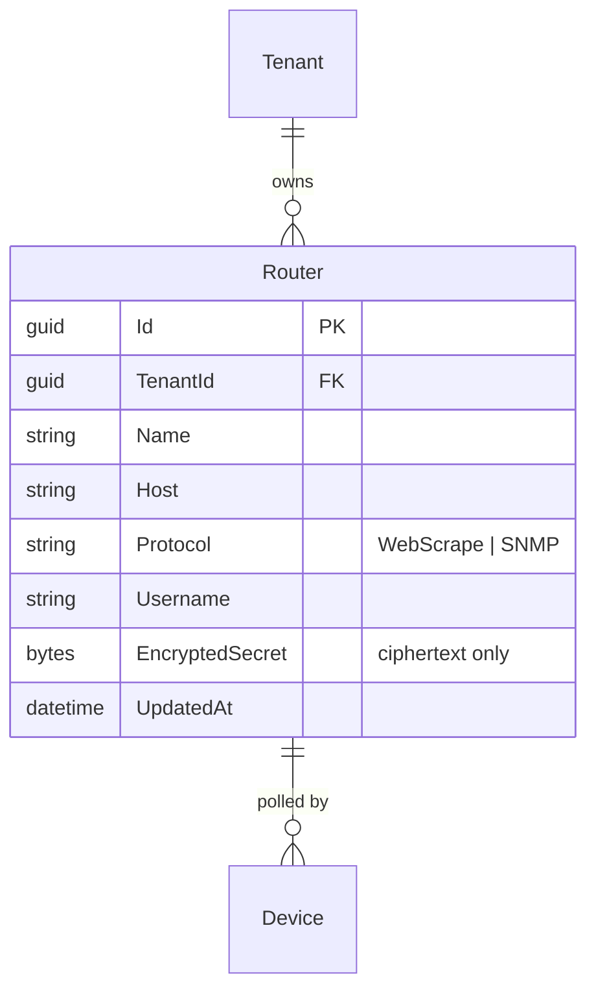
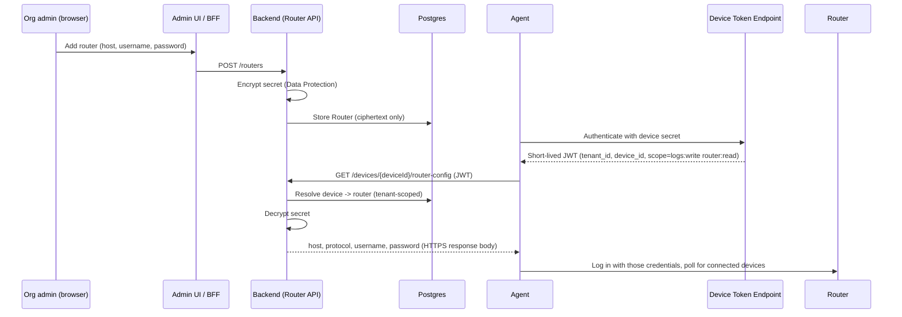

# Router Credentials & Configuration

## The problem

[`05-agents-and-ingestion.md`](05-agents-and-ingestion.md) establishes that
the agent app, not the router, initiates contact with the router — it logs
into the router's own admin web page (or talks SNMP to it) to pull the
current device list. That login needs the router's **own** username/password
(or SNMP community string), which is a completely different credential from
the per-device secret in [ADR-0004](../decisions/0004-device-agent-authentication.md)
that the agent uses to authenticate *to our cloud*. This document is about
where that router-side credential comes from, who is allowed to set it, and
how it safely gets from wherever it's entered to the agent that needs it.

## Where the credential is entered: the Admin UI, not the agent

A **Router** is a first-class, tenant-scoped resource an organization admin
manages from the Admin UI — not something typed directly into the agent app.
An admin adds a router by giving it:

- a name (for their own reference, e.g. "Living room router"),
- a host/IP address on the home network,
- a protocol (`WebScrape` or `SNMP` for MVP — see
  [`05-agents-and-ingestion.md`](05-agents-and-ingestion.md) for why syslog
  forwarding doesn't need a login at all: the router pushes to the agent
  instead of the agent pulling),
- a username, and
- a password / SNMP community string.

This is deliberately centralized rather than left agent-local, because the
person running the Admin UI (the household's account owner) and the person
whose PC/phone happens to run the agent aren't necessarily the same, and a
reinstalled or second agent shouldn't require re-typing the router's password
by hand on every device. See "Alternatives considered" below for the
trade-off this accepts.

## Data model

One `Router` can be polled by more than one `Device`/agent (e.g. a laptop and
a phone both checking the same home router, for redundancy) — that's the
common case this model is built for. The reverse (one agent polling several
routers) isn't a goal for MVP, matching the "agent and router are on the same
home network" assumption already in
[`05-agents-and-ingestion.md`](05-agents-and-ingestion.md).

`Router` is tenant-owned data like everything else in
[`02-multi-tenancy.md`](02-multi-tenancy.md): it carries `TenantId` and is
covered by the same EF Core global query filter and tenant-leak tests as
`Device`.

## Encryption at rest

The router password is the one place this system holds a live, real-world
third-party credential — unlike the device secret (which we mint ourselves
and can revoke), a leaked router password may be reused elsewhere by the
user, so it's treated as more sensitive, not less:

- Never stored in plaintext. The application layer encrypts it before it
  reaches Postgres, using the **ASP.NET Core Data Protection API** — a
  ready-made, already-in-the-framework component, not custom crypto (in
  keeping with principle #1 in [`README.md`](../README.md)).
- Data Protection's key ring is persisted in **Redis**
  (`Microsoft.AspNetCore.DataProtection.StackExchangeRedis`), the same Redis
  already run for [`07-caching-and-idempotency.md`](07-caching-and-idempotency.md),
  so every replica behind the rolling-deployment model in
  [`11-deployment-and-availability.md`](11-deployment-and-availability.md)
  can decrypt what any other replica encrypted, without standing up a
  separate secrets store for v1.
- The Admin UI never displays the secret again after it's saved — same
  write-only UX as the device secret in
  [`05-agents-and-ingestion.md`](05-agents-and-ingestion.md#pairing-a-new-device).
  A `GET` on a router returns metadata (name, host, protocol, username,
  `updatedAt`) and never the secret, whether encrypted or not; updating the
  password is a write-only `PUT`/`PATCH`.

## Permissions

Two entries join the catalog in
[`04-roles-and-permissions.md`](04-roles-and-permissions.md):

- `router.view` — see a router's metadata (host, username, protocol) but
  never its secret.
- `router.manage` — create, update (including rotating the password), and
  delete routers.

Only `router.manage` can write a router's credential, same granularity as
`device.delete` etc.

## How the agent gets the credential

The agent already holds a per-device secret from pairing (ADR-0004) and
exchanges it for a short-lived JWT. That JWT's scope grows by one claim:

- `logs:write` (existing) — call the Logs Ingestion API.
- `router:read` (new) — call the new **Router Config endpoint**.

Notes on this flow:

- The response is scoped by **both** `tenant_id` and `device_id` from the
  JWT, never a client-supplied router id — the same "don't trust a
  client-supplied tenant" rule as
  [`02-multi-tenancy.md`](02-multi-tenancy.md).
- The agent does not persist the router password to disk long-term. It's
  kept in memory for the polling session and re-fetched periodically (or
  immediately on a login failure against the router itself), the same way a
  short-lived JWT is re-minted rather than cached indefinitely — this is
  what lets an admin rotate the router's password in the Admin UI and have
  every agent pick it up without re-pairing anything.
- Every fetch of a router's decrypted credential is written to the
  security/audit log stream from
  [`09-observability.md`](09-observability.md) (who/what fetched it, when)
  — never the credential value itself, matching the existing "what never
  gets logged" rule for device secrets and JWTs.

## Rotation & revocation

- Changing the password in the Admin UI takes effect the next time an agent
  fetches router config — no agent-side re-pairing needed.
- Deleting a `Router`, or unlinking a `Device` from it, immediately removes
  the backend's ability to serve that credential to that device — the same
  immediate-effect revocation model as the device secret in ADR-0004,
  because there's no cached copy of the plaintext anywhere to also clean up.

## Alternatives considered

- **Keep router credentials agent-local only, never sent to the cloud** —
  the assumption this document replaces. Simplest possible design and zero
  cloud blast radius for a third-party credential, but it means the
  household's account owner can't manage or rotate the router login unless
  they're also the one sitting at the machine running the agent, and every
  new/reinstalled agent needs the password re-typed by hand. Rejected
  because the product wants router management to live in the org admin
  panel, not scattered across whichever devices happen to run an agent.
- **A dedicated external secrets manager (HashiCorp Vault / a cloud KMS)
  instead of an encrypted database column** — a stronger isolation boundary
  for secrets, and the right thing to adopt once a concrete deployment
  target is chosen, but an extra moving part not justified before then.
  Deferred for the same reason infra-heavy choices are deferred in
  [ADR-0006](../decisions/0006-defer-auth-platform-extraction.md); revisit
  this doc if/when one is introduced.
- **Require SNMP only, so no interactive admin-page login is ever needed** —
  would sidestep storing a password entirely, but not all consumer routers
  expose SNMP, and scraping the router's own admin web page (the lowest
  common denominator across cheap consumer hardware) inherently needs a
  login. Kept as a per-router `Protocol` choice rather than a mandate, so
  SNMP is used where available.
