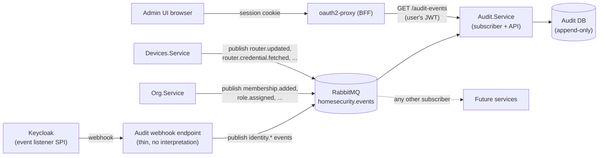

# Auditing & Compliance

This document designs the two things [`09-observability.md`](09-observability.md)
deliberately left as "designed but not built": a **security/audit log** distinct
from operational logging, and the **compliance model** (GDPR, and the security
framework the whole system is built to be auditable against) that audit log
exists to support. This is the design being built against, following this
project's [documentation-first habit](../README.md) of settling the "why"
before the "what." Implementation status: the permissions (§7), the event
envelope contract, the shared publishing library (event publisher,
current-actor), and the domain events `Org.Service` and `Devices.Service`
publish are built, as is `Audit.Service`'s storage model (events, actor
pseudonyms, hash-chain heads, and the append-only database grants); its
subscriber, its read API, the retention job and the Keycloak webhook are not
yet.

## 1. Why this is not just more Serilog output

[`09-observability.md`](09-observability.md) answers "is the system healthy,
and if not, where did it break?" — request latency, queue depth, whether a
dependency is reachable. **Audit answers a different question: "who did what,
to which tenant's data, and when?"** — and it has different requirements that
would be actively harmful to bolt onto operational logging:

| | Operational logs (09) | Audit trail (this document) |
|---|---|---|
| Question answered | Is the system working? | Who did what? |
| Audience | On-call engineers | Org admins, auditors, regulators, incident responders |
| Retention | Short (days–weeks), cost-driven | Long (months–years), compliance-driven |
| Mutability | Fine to lose a log line | Must be tamper-evident; loss undermines its purpose |
| Access | Anyone who can reach Grafana/Loki | Restricted, permission-gated, per-tenant |
| Sink | stdout → log-forwarding sidecar ([09](09-observability.md)) | A queryable store, own retention/access rules |

Folding these together would mean either over-retaining noisy operational
logs (expensive, and a bigger blast radius if that store leaks) or
under-retaining the audit trail (useless for its actual purpose). They stay
architecturally separate even though the write path shares infrastructure
already in the system (RabbitMQ, per [ADR-0007](../decisions/0007-rabbitmq-as-message-bus.md)).

This closes a gap that already exists in the docs today:
[`15-router-credentials.md`](15-router-credentials.md#how-the-agent-gets-the-credential)
and [ADR-0015](../decisions/0015-centralized-encrypted-router-credentials.md)
already promise that every router-credential fetch is written to "the
security/audit log stream" — this document is that stream's actual design.

## 2. What gets audited

An audit event is recorded for anything that changes tenant-owned data,
access, or a security-sensitive credential — never for read-only traffic
(that's what request metrics in [09](09-observability.md) are for) and never
for the router's own log payload (that's product data, covered by
[`05-agents-and-ingestion.md`](05-agents-and-ingestion.md), not an audit
concern).

| Category | Example events | Raised by |
|---|---|---|
| Identity & session | Login succeeded/failed, MFA challenge, password reset, account locked | Keycloak (via event webhook, §3) |
| Membership & access | User invited/removed, role assigned/revoked, custom role created/edited | `Org.Service` |
| Router credentials | Router added/updated/deleted, credential fetched by an agent | `Devices.Service` (the fetch-logging [ADR-0015](../decisions/0015-centralized-encrypted-router-credentials.md) already calls for) |
| Devices | Device updated: acknowledged ("this is mine") and/or renamed | `Devices.Service` |
| Device pairing | Device secret issued, device revoked | `Org.Service` |
| Data subject requests | Export requested/completed, erasure requested/completed | Whichever service handles the request (§5) |

These are not audit-specific messages. Each service publishes every operation
it performs as a **domain event** named for what happened, and the audit trail
is what `Audit.Service` makes of the ones it subscribes to — any other service
may subscribe to the same events. Every event carries a common envelope,
independent of which service raised it (`domain_event_message.json`) —
deliberately the smallest shape that answers "who, what, where, when", with
the event's own extended data in `metadata`:

```json
{
  "eventId": "uuid",
  "occurredAt": "2025-01-01T00:00:00Z",
  "tenantId": "uuid, null for pre-tenant events (e.g. login)",
  "actor": { "type": "User | Device | System", "id": "Keycloak subject | device_id" },
  "action": "role.assigned | router.credential.fetched | ...",
  "target": { "type": "Role | Router | Device | ...", "id": "..." },
  "metadata": { "...": "action-specific, never a secret value" }
}
```

`metadata` follows the same denylist [09](09-observability.md#1-structured-logging-serilog)
already applies to operational logs: no secrets, no JWTs, no plaintext
router credentials, no raw log payloads — only identifiers and the
before/after of what changed (e.g. a role's permission-key diff, not a
password). Each publisher builds `metadata` from an explicit whitelist of
fields, never from a request or entity object, and its tests assert that a
secret never appears in the serialized event.

### The events published today

The event name is the envelope's `action` and also the routing key.

| Event | Published by | Target | `metadata` |
|---|---|---|---|
| `organization.created` | Org | Organization | `identifier`, `name` (the creator becomes first member and Owner — implied, not separate events) |
| `membership.added` | Org | Membership (user id) | — |
| `membership.removed` | Org | Membership (user id) | `removedRoleIds` (the role assignments that went with it) |
| `role.assigned` / `role.unassigned` | Org | UserRole (`userId:roleId`) | `userId`, `roleId`, `roleName` |
| `role.created` | Org | Role | `name`, `permissionKeys` |
| `role.updated` | Org | Role | `previousName`, `name`, `addedPermissionKeys`, `removedPermissionKeys` |
| `role.deleted` | Org | Role | `name`, `unassignedAssignments` (count) |
| `router.created` | Devices | Router | `name`, `host`, `protocol`, `authMode` |
| `router.updated` | Devices | Router | `changes` (name/host/protocol/authMode as from/to, only what changed), `usernameChanged`, `secretRotated` |
| `router.deleted` | Devices | Router | `name`, `host`, `revokedAgentBindings` (count) |
| `router.credential.fetched` | Devices | Router | `deviceCredentialId` — actor is the fetching device |
| `device.updated` | Devices | Device | `changes` (name and/or status as from/to); one event per PATCH, so a combined rename + acknowledge is one event. The MAC address is deliberately not included |

Not yet published, because the code path doesn't exist: device pairing secret
issued/revoked, and data-subject requests.

## 3. Architecture: one more subscriber on the existing bus

No second broker, no Kafka — this was already decided, in passing, while
choosing RabbitMQ itself
([ADR-0007](../decisions/0007-rabbitmq-as-message-bus.md#context): "a
Keycloak-events-to-audit-log idea... resolved to use a webhook onto the same
broker instead of introducing a second one"). This document is that
resolution, made concrete:

- **Keycloak** emits admin events (role/user changes made through Keycloak
  itself) and login events. Keycloak's built-in **event listener SPI**
  ships a webhook-capable listener as a ready-made JAR — configured, not
  coded, per this project's [first principle](../README.md#guiding-principles)
  — that posts each event to a small internal endpoint, which publishes it
  onto RabbitMQ in the common envelope shape above. That endpoint is the one
  bit of glue code this needs; it does no interpretation of the event
  itself.
- **`Org.Service`, `Devices.Service`, and any future service** publish each
  operation they perform as one domain event (the table above) — the same
  "publish now, consume later" pattern
  [`07-caching-and-idempotency.md`](07-caching-and-idempotency.md#3-domain-events-instead-of-something-changed-notifications)
  describes, and the replacement for the earlier coarse
  `access.changed`/`router.changed`/`device.changed` notifications, which had
  no consumer. The routing key is the event name (`role.assigned`) on the
  same `homesecurity.events` exchange — a separate exchange would buy nothing
  today and would mean making the message-bus abstraction exchange-aware — so
  the audit trail isn't a second, parallel stream that could disagree with
  the first: it is one subscriber of the only one. Events are published
  inline, right after the change is saved; a broker outage at that moment
  fails the request with the change committed, which is accepted for now
  (a transactional outbox was considered and rejected as more machinery than
  this stage calls for — see
  [ADR-0020](../decisions/0020-audit-log-and-iso27701-compliance-model.md)).
  The one deliberate exception is the router-credential hand-out, which
  publishes *before* returning the credential so that a failure to record it
  fails the request instead of handing out a credential nobody recorded.
  All the plumbing lives in one small shared library,
  `Common/Dzaba.HomeSecurity.DomainEvents`: the envelope type generated from
  `domain_event_message.json`, the event-name and target-type constants, an
  `IDomainEventPublisher` (`PublishAsync(eventName, targetType, targetId,
  metadata)`, which fills in the event id, timestamp, tenant and actor) and
  `AddDzabaHomeSecurityDomainEvents()` to register it. Who is acting comes from
  a shared `ICurrentActor` (a human's Keycloak subject, or a device's id from
  its token; the system when there is no authenticated request) rather than a
  user id threaded through every service method. Events say what happened
  and what changed, never the whole new state, and a subscriber that needs
  current state still calls the owning service's API.
- **A new `Audit.Service`** subscribes to the events that make up the audit
  trail (its own quorum queue with a dead-letter queue, binding the event
  names it records — the same topology as
  the Go `LogsProcessor` from [ADR-0019](../decisions/0019-go-logs-processor-polyglot-consumer.md)). Per
  [ADR-0016](../decisions/0016-devices-service-owns-its-own-database.md)'s
  now-established default, it owns its **own database** (an `AuditEvent`
  table, effectively append-only) rather than writing into `Org.Service`'s
  or `Devices.Service`'s schemas — the audit trail must survive and remain
  queryable even if the service whose action it describes is degraded, and
  no other service should need write access to it. It also exposes an HTTPS
  **admin read API** — how a user actually sees this — detailed below.



Same idempotency concern as any other RabbitMQ consumer applies here
(at-least-once delivery). Unlike the `SETNX`-on-message-id
pattern in
[`07-caching-and-idempotency.md`](07-caching-and-idempotency.md#2-idempotent-event-processing),
`Audit.Service` dedupes with a **unique index on `eventId`** in its own
database: a redelivered event hits the constraint, is acknowledged, and is
dropped rather than double-recorded. The database is the store of record
here and the constraint has to exist regardless, so adding a Redis check in
front would only introduce a Redis-outage failure mode (fail open ⇒ risk of
duplicates, fail closed ⇒ stalled audit trail) with no additional safety.

### The admin read API — how a user actually sees this

`Audit.Service` is not consumer-only: it's a normal fourth admin-facing
service in the same shape as `Org.Service` and `Devices.Service`, and slots
into the same request path already drawn in
[`01-overview.md`](01-overview.md#system-context) — a browser never talks to
it directly, only through the BFF:

```
Browser --(HttpOnly session cookie)--> oauth2-proxy --(user's JWT)--> Audit.Service --> Audit DB
```

Nothing new is invented to make that work — every piece reuses a mechanism
this system already has:

- **Authentication**: the standard Keycloak `JwtBearer` scheme, exactly like
  `Org.Service`'s and `Devices.Service`'s admin APIs
  ([`03-security-and-identity.md`](03-security-and-identity.md)). There's no
  device-token scheme here at all — agents never call this API, only humans
  through the Admin UI (or a future third-party integrator).
- **Authorization**: the new `audit.view` permission (§7), checked the same
  cross-service way `Devices.Service` already checks `router.manage` —
  `IPermissionSourceLoader` against the shared Redis cache, falling back to
  `Org.Service`'s `GET /orgs/{orgId}/access-context` on a miss
  ([`04-roles-and-permissions.md`](04-roles-and-permissions.md#checking-a-permission-from-a-service-that-doesnt-own-this-data)).
  `Audit.Service` doesn't own that permission data any more than
  `Devices.Service` does, so it uses the same abstraction rather than a new
  one.
- **URI versioning and HAL**: `/api/v1/...`
  ([`12-api-versioning.md`](12-api-versioning.md)), and HAL responses
  ([`13-hateoas-public-api.md`](13-hateoas-public-api.md)) — this is a
  human-navigated, Admin-UI-facing resource, exactly the category
  [ADR-0017](../decisions/0017-hateoas-extends-to-devices-service.md)
  already extended HAL to (it does *not* get the plain-JSON exception that
  applies to agent-facing/service-to-service endpoints like the
  router-config fetch, because a user genuinely browses this — paging
  through it, following links — rather than one system machine-calling
  another).
- **Contract-first**: two schemas under `src/contracts/json/`, same pipeline
  as every other resource
  ([`08-api-contracts-and-codegen.md`](08-api-contracts-and-codegen.md)):
  `domain_event_message.json` is the bus envelope from §2 (generated into
  `Common/Dzaba.HomeSecurity.DomainEvents`, shared by every publisher and by
  `Audit.Service`), and `audit_event.json` is the API resource this
  section's endpoints return.

| Endpoint | Purpose | Auth |
|---|---|---|
| `GET /api/v1/orgs/{orgId}/audit-events` | Paginated, filterable list (`from`, `to`, `actorId`, `actorType`, `action`, `targetType`, `targetId`, `page`) | JWT + `audit.view` |
| `GET /api/v1/orgs/{orgId}/audit-events/{eventId}` | One event's full detail | JWT + `audit.view` |

A list response is a standard HAL collection — same envelope shape as
[`13-hateoas-public-api.md`](13-hateoas-public-api.md#the-format-hal), with
`next`/`prev` doing the pagination work instead of a client hand-building
`?page=N`:

```json
{
  "_links": {
    "self": { "href": "/api/v1/orgs/9c1e.../audit-events?page=2" },
    "next": { "href": "/api/v1/orgs/9c1e.../audit-events?page=3" },
    "prev": { "href": "/api/v1/orgs/9c1e.../audit-events?page=1" },
    "organization": { "href": "/api/v1/orgs/9c1e..." }
  },
  "_embedded": {
    "auditEvents": [
      {
        "eventId": "7b1c...",
        "occurredAt": "2026-01-01T09:03:00Z",
        "actor": { "type": "User", "id": "a1b2..." },
        "action": "role.assigned",
        "target": { "type": "UserRole", "id": "c3d4..." },
        "metadata": { "role": "Admin", "grantedTo": "e5f6..." },
        "_links": {
          "self": { "href": "/api/v1/orgs/9c1e.../audit-events/7b1c..." }
        }
      }
    ]
  }
}
```

Deliberately **no write/action links** on an audit event's `_links` (no
`acknowledge`, no `delete`) — unlike the device example in
[`13-hateoas-public-api.md`](13-hateoas-public-api.md#the-format-hal), a
link's presence there encodes "is this currently allowed," but nothing about
an immutable audit record is ever actionable; `_links` here only ever
carries navigation (`self`, `organization`, pagination), never a capability
check.

Two things this endpoint deliberately does *not* do, to keep it distinct
from the GDPR **export** endpoint mentioned in §5: it never returns another
tenant's data (same tenant-scoping rule as everywhere else,
[`02-multi-tenancy.md`](02-multi-tenancy.md)), and it's a read-only view for
an admin auditing their own org, not the mechanism a user's personal-data
export is built from — those overlap in the data they draw on but answer
different questions ("what happened in my org" vs. "what data do you hold
about me").

## 4. Retention, immutability, and access

- **Append-only.** `Audit.Service`'s database role has `INSERT`/`SELECT`
  only on the event table — no `UPDATE`, no `DELETE`, no `TRUNCATE` —
  enforced at the Postgres grant level, not just by convention in application
  code. The initial migration creates two `NOLOGIN` group roles: `audit_writer`
  (insert/select events and pseudonyms, insert/select/update the chain heads)
  and `audit_purger` (select/delete events, select/delete pseudonyms — the
  one sanctioned exception, for retention and erasure, run by a separate
  job under a separate login). Whoever provisions the database makes the
  service's login a member of `audit_writer` and the job's a member of
  `audit_purger`; creating the roles needs `CREATEROLE`, so the migration runs
  as a suitably privileged owner (the superuser in the local stack). This is
  verified against a real Postgres, not just asserted: as a member of
  `audit_writer`, `UPDATE`/`DELETE`/`TRUNCATE` on events fail with "permission
  denied".
- **Tamper-evident, not just tamper-resistant.** Grants stop the application
  from editing history, but not someone with database-level access. So each
  stored event also carries `prevHash` and `hash`, where
  `hash = SHA-256(prevHash ‖ canonical(event))`, forming a chain **per
  tenant and category** (a chain per category, so purging a short-retention
  category never has to skip over a long-retention event). The canonical form
  is a versioned, length-prefixed encoding of the event's fields (so shifting
  a boundary between two fields can't produce the same bytes), pinned by a
  known-answer test because changing it would invalidate every stored hash.
  Two details make the hash survive a database round trip: `occurredAt` is
  truncated to whole microseconds *before* hashing and storing (Postgres rounds
  a 100 ns .NET timestamp, so a hash over the unrounded value would not
  match the stored one), and `metadata` is stored as `json`, not `jsonb`
  (jsonb reorders keys and normalises whitespace, changing the text that was
  hashed). Order is the order
  events are stored in the audit database, serialized per chain by
  row-locking a small chain-head row inside the insert transaction. An
  integrity check re-walks a chain and reports the first event whose hash
  doesn't match; the API exposes it to `audit.view` holders, and a periodic
  job runs the same check. The oldest part of a chain is removed by the
  retention purge, so the purge records a checkpoint (the last purged
  event's hash) and verification starts from it.
- **Stored shape.** Besides the envelope fields from §2, a stored event has
  a database sequence number, a `receivedAt` (set by `Audit.Service`;
  `occurredAt` is set by the producer, so the two together show clock skew or
  delivery lag), a category derived from the action, and an **actor token**
  instead of the raw actor id (see §5). Actor tokens are created on first
  sight of an actor and kept in a separate mapping table, which is *not*
  append-only.
- **Retention is per-category, not one global number**, since GDPR's storage
  limitation principle (§5) requires keeping personal data no longer than
  necessary while security/audit needs sometimes justify longer retention:
  - Identity/session and access-change events: proposed 1 year, a common
    baseline for security audit trails.
  - Router-credential-fetch events: proposed 1 year, matching the above —
    this is the exact category [ADR-0015](../decisions/0015-centralized-encrypted-router-credentials.md)
    calls for.
  - Data-subject-request events (export/erasure): proposed 3 years, since
    these are the evidence that a GDPR obligation was actually met.
  Windows are configuration, not code, so a legal review can change them
  without a release. A scheduled job deletes events past their category's
  retention window — the one sanctioned mutation against an otherwise
  append-only store — under the separate purge role, writes the chain
  checkpoint described above, and itself records an audit event of what it
  removed.
- **Access** is itself audit-worthy: only `audit.view` (new permission, org
  admin/owner by default) can read a tenant's own audit trail via the Admin
  UI, scoped to that tenant exactly like every other permission in
  [`04-roles-and-permissions.md`](04-roles-and-permissions.md) — there is no
  cross-tenant view, including for us as operators, without going through a
  documented support/legal process (out of scope here). Reading the trail is
  recorded too: `Audit.Service` writes an `audit.viewed` event into its own
  store for each read.

## 5. GDPR

HomeSecurity is a **data controller** for account/organization data (who
signed up, who's a member of what) and a **data controller** (not merely a
processor) for the router/device data it collects too, since it decides why
that data is collected and how long it's kept — there's no separate customer
on whose behalf we're just processing.

### Personal data inventory

| Data | Where it lives | Why it's personal data |
|---|---|---|
| Email, name | Keycloak | Directly identifies a person |
| `tenant_id`/`user_id` in logs and audit events | Everywhere ([09](09-observability.md), this doc) | Ties activity to a person |
| Router credentials | `Devices.Service` DB, encrypted | A third party's login, incidentally personal (often reused elsewhere by the user) |
| MAC addresses / device names | `Devices.Service` DB | Can identify a specific person's device, and by extension their presence on the network |
| Push tokens | Notification Service DB (not yet built) | Tied to one person's device |

Raw router log payloads are already treated as sensitive-by-default and
never logged verbatim
([09](09-observability.md#1-structured-logging-serilog)) — the same
sensitivity applies for the same reason under GDPR: they can describe every
device in someone's home.

### Data subject rights

| Right | How it's met |
|---|---|
| Access | Export endpoint (not yet built) returning the account's own org/device/audit data as a downloadable JSON, reusing the JSON-Schema-first contract approach ([08](08-api-contracts-and-codegen.md)) |
| Erasure | Deleting an organization cascades: memberships, devices, routers (credentials wiped, not just soft-deleted), push registrations. Audit events referencing the deleted user are **pseudonymized** — the event only ever held an opaque actor token, and erasure deletes the token → identity mapping — not deleted; see "the erasure vs. audit-trail tension" below |
| Rectification | Already covered by existing PATCH endpoints (device name, org membership) |
| Portability | The same export as "Access," in a structured format — JSON already qualifies |
| Object / restrict processing | Not applicable in the same way for a security-monitoring product the user actively opted into (the product's entire function is the processing) — documented here as considered, not silently skipped |

### The erasure vs. audit-trail tension

The right to erasure isn't absolute: GDPR Art. 17(3) permits retaining data
where there's a legal obligation or a legitimate interest that overrides it
— a security audit trail proving *who* changed *what* access, kept for a
bounded retention period (§4), is exactly that case, and is the standard
justification used by any product with an access-control audit log. The
resolution here is a middle ground, not "ignore erasure requests for audit
data": the **event stays** (it's evidence the action happened) but the
**actor is pseudonymized** once the underlying account is erased, severing
the direct link to the person while preserving the record's evidentiary
value ("some account performed this role change on this date") for the
remainder of its retention window.

The mechanism is deliberately *not* "rewrite the actor id in every event":
on ingest, `Audit.Service` swaps the actor's real id for a stable opaque
token (one per actor), and keeps the token → real id mapping in a separate
table. Erasing a person deletes that one mapping row. The event rows are
never updated, so the append-only grants and the hash chain (§4) stay valid,
and the read API renders an event whose token has no mapping as
`{ "id": null, "erased": true }`. Because the token is stable, an auditor can
still tell that two events came from the same (now anonymous) actor.
The raw actor id does travel on the bus in the event, and any other
subscriber sees it — only `Audit.Service` tokenizes it — so a future
subscriber that stores events takes on its own erasure obligation.

**Open question — people who are the *target*, not the actor.** Events such
as `membership.added` and `role.assigned` carry the affected user's id in the
target (and in `metadata`), and the actor token doesn't touch those. Erasing
that link (e.g. tokenizing user ids in targets the same way, or dropping them
from stored metadata once the account is erased) is not designed yet; it has
to be settled together with the erasure work in §5, before `Audit.Service`
stores its first event.

### Lawful basis, breach notification, sub-processors

- **Lawful basis**: contract necessity for account/org data (can't provide
  the service without it); legitimate interest for security/audit logging
  itself.
- **Breach notification**: the 72-hour authority-notification clock starts
  at detection — the audit trail (§2–4) is the primary evidence base for
  scoping a breach ("which tenants, which data, since when"), which is the
  main reason this design exists at all, not an afterthought bolted onto a
  security feature.
- **Sub-processors** needing a Data Processing Agreement once this goes
  beyond a portfolio project: the hosting provider, Keycloak (self-hosted,
  so only relevant if hosted infra counts), and Google (FCM) for push
  delivery. Tracked here as a checklist item, not designed further — it's a
  legal/contracting task, not an architecture one.

## 6. Security framework: ISO/IEC 27001, extended by ISO/IEC 27701 for GDPR

Rather than inventing a bespoke compliance checklist, this system is
designed to be **auditable against ISO/IEC 27001** (the standard information
security management system, ISMS, model) — not pursuing certification now
(no auditor, no customer requiring it yet, consistent with the
"not now, revisit when it hurts" posture already used for
[ADR-0006](../decisions/0006-defer-auth-platform-extraction.md) and
[15](15-router-credentials.md#alternatives-considered)'s deferred secrets
manager), but designing so that a real certification effort later is a
paperwork exercise, not a redesign.

**ISO/IEC 27701** is the natural extension for the GDPR half of this: it's
the published ISO standard that layers a Privacy Information Management
System on top of 27001's Annex A controls and maps them directly onto data
protection obligations like the ones in §5 — using it means GDPR compliance
and the security ISMS are one coherent control set, not two parallel
documents that drift apart.

A sample of how Annex A control families already map onto decisions made
elsewhere in this repo — not exhaustive, but enough to show the fit is real,
not aspirational:

| Annex A theme | Where it's already addressed |
|---|---|
| A.5 Access control | [`04-roles-and-permissions.md`](04-roles-and-permissions.md) (RBAC), [`03-security-and-identity.md`](03-security-and-identity.md) (auth) |
| A.8 Asset management / data classification | §2's audit categories, [09](09-observability.md)'s "what never gets logged" |
| A.8.24 Cryptography | [ADR-0015](../decisions/0015-centralized-encrypted-router-credentials.md) (Data Protection API), device tokens ([ADR-0018](../decisions/0018-per-service-device-token-audience-and-key.md)) |
| A.8.15/16 Logging & monitoring | [09-observability.md](09-observability.md) (operational), this document (audit) |
| A.8.20 Network security | [ADR-0008](../decisions/0008-https-everywhere.md) (HTTPS-only) |
| A.5.29/30 Incident management & continuity | [11-deployment-and-availability.md](11-deployment-and-availability.md), the breach-notification flow in §5, using this document's audit trail as evidence |
| A.5.34 Privacy / PII protection | This document's §5, ISO 27701's PIMS extension |

This table is the seed of a future **Statement of Applicability** (the
document an ISO 27001 audit actually asks for) — not written in full here,
since it only earns its keep once certification is a real goal, but every
row above already has a real design decision behind it rather than a gap to
paper over.

## 7. New permission catalog entries

Joining the catalog in [`04-roles-and-permissions.md`](04-roles-and-permissions.md):

- `audit.view` — read a tenant's own audit trail. Granted to `Owner`/`Admin`
  by default, like other sensitive read permissions.
- `data_subject_request.manage` — initiate/complete an export or erasure
  request on behalf of the org (distinct from `audit.view`, since acting on
  a data-subject request is a write, not a read).

## 8. Explicitly out of scope for this design pass

- The actual `Audit.Service` implementation, its solution/project scaffold,
  and the Keycloak webhook endpoint — this document is the design to build
  against, not the build itself.
- A formal Statement of Applicability or Record of Processing Activities
  (ROPA) document — real compliance artifacts, worth producing once
  certification or a DPA/legal review is actually on the table.
- Cookie consent / tracking consent — not applicable yet; the Admin UI has
  no third-party analytics or marketing cookies today.
- A dedicated secrets manager for the audit store itself — same deferred
  status as the router-credential store's own secrets-manager question in
  [`15-router-credentials.md`](15-router-credentials.md#alternatives-considered).

## Related documents

- Operational logging this document is deliberately separate from:
  [`09-observability.md`](09-observability.md)
- RabbitMQ as the shared bus, and why not a second broker:
  [ADR-0007](../decisions/0007-rabbitmq-as-message-bus.md)
- The domain events (which replaced the coarse `*.changed` notifications)
  this trail is built from, and how they relate to state:
  [`07-caching-and-idempotency.md`](07-caching-and-idempotency.md#3-domain-events-instead-of-something-changed-notifications)
- Per-service database ownership, the pattern `Audit.Service` follows:
  [ADR-0016](../decisions/0016-devices-service-owns-its-own-database.md)
- Roles/permissions catalog `audit.view` and `data_subject_request.manage`
  join: [`04-roles-and-permissions.md`](04-roles-and-permissions.md)
- The credential-fetch audit entry this document makes concrete:
  [`15-router-credentials.md`](15-router-credentials.md#how-the-agent-gets-the-credential),
  [ADR-0015](../decisions/0015-centralized-encrypted-router-credentials.md)
- Multi-tenancy (why every audit event carries `tenant_id`):
  [`02-multi-tenancy.md`](02-multi-tenancy.md)
