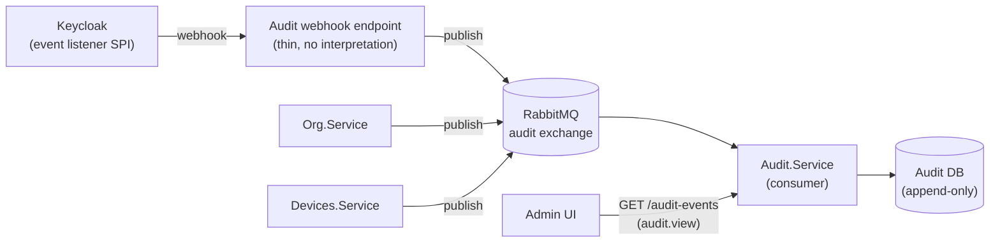

# Auditing & Compliance

This document designs the two things [`09-observability.md`](09-observability.md)
deliberately left as "designed but not built": a **security/audit log** distinct
from operational logging, and the **compliance model** (GDPR, and the security
framework the whole system is built to be auditable against) that audit log
exists to support. Nothing here is implemented yet — this is the design to
build against when that work is picked up, following this project's
[documentation-first habit](../README.md) of settling the "why" before the
"what."

## 1. Why this is not just more Serilog output

[`09-observability.md`](09-observability.md) answers "is the system healthy,
and if not, where did it break?" — request latency, queue depth, whether a
dependency is reachable. **Audit answers a different question: "who did what,
to which tenant's data, and when?"** — and it has different requirements that
would be actively harmful to bolt onto operational logging:

| | Operational logs (09) | Audit trail (this document) |
|---|---|---|
| Question answered | Is the system working? | Who did what? |
| Audience | On-call engineers | Org admins, auditors, regulators, incident responders |
| Retention | Short (days–weeks), cost-driven | Long (months–years), compliance-driven |
| Mutability | Fine to lose a log line | Must be tamper-evident; loss undermines its purpose |
| Access | Anyone who can reach Grafana/Loki | Restricted, permission-gated, per-tenant |
| Sink | stdout → log-forwarding sidecar ([09](09-observability.md)) | A queryable store, own retention/access rules |

Folding these together would mean either over-retaining noisy operational
logs (expensive, and a bigger blast radius if that store leaks) or
under-retaining the audit trail (useless for its actual purpose). They stay
architecturally separate even though the write path shares infrastructure
already in the system (RabbitMQ, per [ADR-0007](../decisions/0007-rabbitmq-as-message-bus.md)).

This closes a gap that already exists in the docs today:
[`15-router-credentials.md`](15-router-credentials.md#how-the-agent-gets-the-credential)
and [ADR-0015](../decisions/0015-centralized-encrypted-router-credentials.md)
already promise that every router-credential fetch is written to "the
security/audit log stream" — this document is that stream's actual design.

## 2. What gets audited

An audit event is recorded for anything that changes tenant-owned data,
access, or a security-sensitive credential — never for read-only traffic
(that's what request metrics in [09](09-observability.md) are for) and never
for the router's own log payload (that's product data, covered by
[`05-agents-and-ingestion.md`](05-agents-and-ingestion.md), not an audit
concern).

| Category | Example events | Raised by |
|---|---|---|
| Identity & session | Login succeeded/failed, MFA challenge, password reset, account locked | Keycloak (via event webhook, §3) |
| Membership & access | User invited/removed, role assigned/revoked, custom role created/edited | `Org.Service` |
| Router credentials | Router added/updated/deleted, credential fetched by an agent | `Devices.Service` (the fetch-logging [ADR-0015](../decisions/0015-centralized-encrypted-router-credentials.md) already calls for) |
| Devices | Device acknowledged ("this is mine"), device renamed | `Devices.Service` |
| Device pairing | Device secret issued, device revoked | `Org.Service` |
| Data subject requests | Export requested/completed, erasure requested/completed | Whichever service handles the request (§5) |

Every event carries a common envelope, independent of which service raised
it — deliberately the smallest shape that answers "who, what, where, when":

```json
{
  "eventId": "uuid",
  "occurredAt": "2025-01-01T00:00:00Z",
  "tenantId": "uuid, null for pre-tenant events (e.g. login)",
  "actor": { "type": "User | Device | System", "id": "Keycloak subject | device_id" },
  "action": "role.assigned | router.credential.fetched | ...",
  "target": { "type": "Role | Router | Device | ...", "id": "..." },
  "metadata": { "...": "action-specific, never a secret value" }
}
```

`metadata` follows the same denylist [09](09-observability.md#1-structured-logging-serilog)
already applies to operational logs: no secrets, no JWTs, no plaintext
router credentials, no raw log payloads — only identifiers and the
before/after of what changed (e.g. a role's permission-key diff, not a
password).

## 3. Architecture: one more consumer on the existing bus

No second broker, no Kafka — this was already decided, in passing, while
choosing RabbitMQ itself
([ADR-0007](../decisions/0007-rabbitmq-as-message-bus.md#context): "a
Keycloak-events-to-audit-log idea... resolved to use a webhook onto the same
broker instead of introducing a second one"). This document is that
resolution, made concrete:

- **Keycloak** emits admin events (role/user changes made through Keycloak
  itself) and login events. Keycloak's built-in **event listener SPI**
  ships a webhook-capable listener as a ready-made JAR — configured, not
  coded, per this project's [first principle](../README.md#guiding-principles)
  — that posts each event to a small internal endpoint, which publishes it
  onto RabbitMQ in the common envelope shape above. That endpoint is the one
  bit of glue code this needs; it does no interpretation of the event
  itself.
- **`Org.Service`, `Devices.Service`, and any future service** publish audit
  events directly for their own domain actions (role assigned, router
  updated, credential fetched) — the same "publish a domain event" pattern
  the notification events in
  [`07-caching-and-idempotency.md`](07-caching-and-idempotency.md#3-coarse-something-changed-notification-events)
  already established, just to a dedicated `audit` exchange/routing key
  instead of the coarse `*.changed` ones. These are *not* the same events as
  `access.changed`/`router.changed`/`device.changed`: those say "something
  changed, go re-check current state"; audit events are the immutable record
  of the change itself, and are never consumed to reconstruct current
  state.
- **A new `Audit.Service`** is the sole consumer of the `audit` exchange. Per
  [ADR-0016](../decisions/0016-devices-service-owns-its-own-database.md)'s
  now-established default, it owns its **own database** (an `AuditEvent`
  table, effectively append-only) rather than writing into `Org.Service`'s
  or `Devices.Service`'s schemas — the audit trail must survive and remain
  queryable even if the service whose action it describes is degraded, and
  no other service should need write access to it. It exposes one read API
  (`GET /api/v1/orgs/{orgId}/audit-events`, filterable by date range, actor,
  action, target), gated by a new `audit.view` permission (§6).



Same idempotency concern as any other RabbitMQ consumer applies here
(at-least-once delivery) — `Audit.Service` reuses the `SETNX`-on-message-id
pattern from
[`07-caching-and-idempotency.md`](07-caching-and-idempotency.md#2-idempotent-event-processing)
rather than inventing a second deduplication mechanism, so a redelivered
event is dropped, not double-recorded.

## 4. Retention, immutability, and access

- **Append-only.** `Audit.Service`'s database role has `INSERT`/`SELECT`
  only — no `UPDATE`, no `DELETE` — enforced at the Postgres grant level,
  not just by convention in application code. A purge job (below) is the
  one exception, run under a separate, more privileged role.
- **Retention is per-category, not one global number**, since GDPR's storage
  limitation principle (§5) requires keeping personal data no longer than
  necessary while security/audit needs sometimes justify longer retention:
  - Identity/session and access-change events: proposed 1 year, a common
    baseline for security audit trails.
  - Router-credential-fetch events: proposed 1 year, matching the above —
    this is the exact category [ADR-0015](../decisions/0015-centralized-encrypted-router-credentials.md)
    calls for.
  - Data-subject-request events (export/erasure): proposed 3 years, since
    these are the evidence that a GDPR obligation was actually met.
  A scheduled job deletes events past their category's retention window —
  the one sanctioned mutation against an otherwise append-only store.
- **Access** is itself audit-worthy: only `audit.view` (new permission, org
  admin/owner by default) can read a tenant's own audit trail via the Admin
  UI, scoped to that tenant exactly like every other permission in
  [`04-roles-and-permissions.md`](04-roles-and-permissions.md) — there is no
  cross-tenant view, including for us as operators, without going through a
  documented support/legal process (out of scope here).

## 5. GDPR

HomeSecurity is a **data controller** for account/organization data (who
signed up, who's a member of what) and a **data controller** (not merely a
processor) for the router/device data it collects too, since it decides why
that data is collected and how long it's kept — there's no separate customer
on whose behalf we're just processing.

### Personal data inventory

| Data | Where it lives | Why it's personal data |
|---|---|---|
| Email, name | Keycloak | Directly identifies a person |
| `tenant_id`/`user_id` in logs and audit events | Everywhere ([09](09-observability.md), this doc) | Ties activity to a person |
| Router credentials | `Devices.Service` DB, encrypted | A third party's login, incidentally personal (often reused elsewhere by the user) |
| MAC addresses / device names | `Devices.Service` DB | Can identify a specific person's device, and by extension their presence on the network |
| Push tokens | Notification Service DB (not yet built) | Tied to one person's device |

Raw router log payloads are already treated as sensitive-by-default and
never logged verbatim
([09](09-observability.md#1-structured-logging-serilog)) — the same
sensitivity applies for the same reason under GDPR: they can describe every
device in someone's home.

### Data subject rights

| Right | How it's met |
|---|---|
| Access | Export endpoint (not yet built) returning the account's own org/device/audit data as a downloadable JSON, reusing the JSON-Schema-first contract approach ([08](08-api-contracts-and-codegen.md)) |
| Erasure | Deleting an organization cascades: memberships, devices, routers (credentials wiped, not just soft-deleted), push registrations. Audit events referencing the deleted user are **pseudonymized** (actor id replaced with a stable opaque token), not deleted — see "the erasure vs. audit-trail tension" below |
| Rectification | Already covered by existing PATCH endpoints (device name, org membership) |
| Portability | The same export as "Access," in a structured format — JSON already qualifies |
| Object / restrict processing | Not applicable in the same way for a security-monitoring product the user actively opted into (the product's entire function is the processing) — documented here as considered, not silently skipped |

### The erasure vs. audit-trail tension

The right to erasure isn't absolute: GDPR Art. 17(3) permits retaining data
where there's a legal obligation or a legitimate interest that overrides it
— a security audit trail proving *who* changed *what* access, kept for a
bounded retention period (§4), is exactly that case, and is the standard
justification used by any product with an access-control audit log. The
resolution here is a middle ground, not "ignore erasure requests for audit
data": the **event stays** (it's evidence the action happened) but the
**actor identifier is pseudonymized** once the underlying account is erased,
severing the direct link to the person while preserving the record's
evidentiary value ("some account performed this role change on this date")
for the remainder of its retention window.

### Lawful basis, breach notification, sub-processors

- **Lawful basis**: contract necessity for account/org data (can't provide
  the service without it); legitimate interest for security/audit logging
  itself.
- **Breach notification**: the 72-hour authority-notification clock starts
  at detection — the audit trail (§2–4) is the primary evidence base for
  scoping a breach ("which tenants, which data, since when"), which is the
  main reason this design exists at all, not an afterthought bolted onto a
  security feature.
- **Sub-processors** needing a Data Processing Agreement once this goes
  beyond a portfolio project: the hosting provider, Keycloak (self-hosted,
  so only relevant if hosted infra counts), and Google (FCM) for push
  delivery. Tracked here as a checklist item, not designed further — it's a
  legal/contracting task, not an architecture one.

## 6. Security framework: ISO/IEC 27001, extended by ISO/IEC 27701 for GDPR

Rather than inventing a bespoke compliance checklist, this system is
designed to be **auditable against ISO/IEC 27001** (the standard information
security management system, ISMS, model) — not pursuing certification now
(no auditor, no customer requiring it yet, consistent with the
"not now, revisit when it hurts" posture already used for
[ADR-0006](../decisions/0006-defer-auth-platform-extraction.md) and
[15](15-router-credentials.md#alternatives-considered)'s deferred secrets
manager), but designing so that a real certification effort later is a
paperwork exercise, not a redesign.

**ISO/IEC 27701** is the natural extension for the GDPR half of this: it's
the published ISO standard that layers a Privacy Information Management
System on top of 27001's Annex A controls and maps them directly onto data
protection obligations like the ones in §5 — using it means GDPR compliance
and the security ISMS are one coherent control set, not two parallel
documents that drift apart.

A sample of how Annex A control families already map onto decisions made
elsewhere in this repo — not exhaustive, but enough to show the fit is real,
not aspirational:

| Annex A theme | Where it's already addressed |
|---|---|
| A.5 Access control | [`04-roles-and-permissions.md`](04-roles-and-permissions.md) (RBAC), [`03-security-and-identity.md`](03-security-and-identity.md) (auth) |
| A.8 Asset management / data classification | §2's audit categories, [09](09-observability.md)'s "what never gets logged" |
| A.8.24 Cryptography | [ADR-0015](../decisions/0015-centralized-encrypted-router-credentials.md) (Data Protection API), device tokens ([ADR-0018](../decisions/0018-per-service-device-token-audience-and-key.md)) |
| A.8.15/16 Logging & monitoring | [09-observability.md](09-observability.md) (operational), this document (audit) |
| A.8.20 Network security | [ADR-0008](../decisions/0008-https-everywhere.md) (HTTPS-only) |
| A.5.29/30 Incident management & continuity | [11-deployment-and-availability.md](11-deployment-and-availability.md), the breach-notification flow in §5, using this document's audit trail as evidence |
| A.5.34 Privacy / PII protection | This document's §5, ISO 27701's PIMS extension |

This table is the seed of a future **Statement of Applicability** (the
document an ISO 27001 audit actually asks for) — not written in full here,
since it only earns its keep once certification is a real goal, but every
row above already has a real design decision behind it rather than a gap to
paper over.

## 7. New permission catalog entries

Joining the catalog in [`04-roles-and-permissions.md`](04-roles-and-permissions.md):

- `audit.view` — read a tenant's own audit trail. Granted to `Owner`/`Admin`
  by default, like other sensitive read permissions.
- `data_subject_request.manage` — initiate/complete an export or erasure
  request on behalf of the org (distinct from `audit.view`, since acting on
  a data-subject request is a write, not a read).

## 8. Explicitly out of scope for this design pass

- The actual `Audit.Service` implementation, its solution/project scaffold,
  and the Keycloak webhook endpoint — this document is the design to build
  against, not the build itself.
- A formal Statement of Applicability or Record of Processing Activities
  (ROPA) document — real compliance artifacts, worth producing once
  certification or a DPA/legal review is actually on the table.
- Cookie consent / tracking consent — not applicable yet; the Admin UI has
  no third-party analytics or marketing cookies today.
- A dedicated secrets manager for the audit store itself — same deferred
  status as the router-credential store's own secrets-manager question in
  [`15-router-credentials.md`](15-router-credentials.md#alternatives-considered).

## Related documents

- Operational logging this document is deliberately separate from:
  [`09-observability.md`](09-observability.md)
- RabbitMQ as the shared bus, and why not a second broker:
  [ADR-0007](../decisions/0007-rabbitmq-as-message-bus.md)
- The coarse `*.changed` notification events this is not the same as:
  [`07-caching-and-idempotency.md`](07-caching-and-idempotency.md#3-coarse-something-changed-notification-events)
- Per-service database ownership, the pattern `Audit.Service` follows:
  [ADR-0016](../decisions/0016-devices-service-owns-its-own-database.md)
- Roles/permissions catalog `audit.view` and `data_subject_request.manage`
  join: [`04-roles-and-permissions.md`](04-roles-and-permissions.md)
- The credential-fetch audit entry this document makes concrete:
  [`15-router-credentials.md`](15-router-credentials.md#how-the-agent-gets-the-credential),
  [ADR-0015](../decisions/0015-centralized-encrypted-router-credentials.md)
- Multi-tenancy (why every audit event carries `tenant_id`):
  [`02-multi-tenancy.md`](02-multi-tenancy.md)
